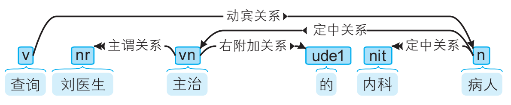

# 自然语言处理初步

## NLP的目的和层次

> [Introduction-NLP/1. 新手上路.md at master · NLP-LOVE/Introduction-NLP](https://github.com/NLP-LOVE/Introduction-NLP/blob/master/chapter/1.%20%E6%96%B0%E6%89%8B%E4%B8%8A%E8%B7%AF.md)

NLP 也就是自然语言处理。

1. 自然语言理解（NLU）：

让计算机能具备一定理解自然语言的能力，比如：

- 阅读理解
- 机器翻译

- ......

2. 自然语言生成（NLG）：

让计算机有一定创造力，比如：

- 写诗机器人：让机器人写一首好诗
- 写作文机器人
- ……

1. 语音、图像和文本

   自然语言处理系统的输入源一共有3个，即语音、图像与文本。语音和图像这两种形式一般经过识别后转化为文字，转化后就可以进行后续的NLP任务了。

2. 中文分词、词性标注和命名实体识别

   这3个任务都是围绕词语进行的分析，所以统称词法分析。词法分析的主要任务是将文本分隔为有意义的词语(中文分词)，确定每个词语的类别和浅层的歧义消除(词性标注)，并且识别出一些较长的专有名词(命名实体识别)。对中文而言，词法分析常常是后续高级任务的基础。

3. 信息抽取

   词法分析之后，文本已经呈现出部分结构化的趋势，根据分析出来的每个单词和附有自己词性及其他标签的数据，抽取出一部分有用的信息，关键词、专业术语等，也可以根据统计学信息抽取出更大颗粒度的文本。

4. 文本分类与文本聚类

   将文本拆分为一系列词语之后，就可以对文本进行分类和聚类操作，找出相类似的文本。

5. 句法分析

   词法分析只能得到零散的词汇信息，计算机不知道词语之间的关系。在一些问答系统中，需要得到句子的主谓宾结构，这就是句法分析得到的结果，如下图所示：

   [](https://github.com/NLP-LOVE/Introduction-NLP/raw/master/img/2020-2-3_12-8-55.png)

   不仅是问答系统或搜索引擎，句法分析还经常应用有基于短语的机器翻译，给译文的词语重新排序。
6. 语义分析与篇章分析

相较于句法分析，语义分析侧重语义而非语法。它包括词义消歧(确定一个词在语境中的含义，而不是简单的词性)、语义角色标注(标注句子中的谓语与其他成分的关系)乃至语义依存分析(分析句子中词语之间的语义关系)。

7. 其他高级任务

   自动问答、自动摘要、机器翻译

   注意，一般认为信息检索(Information Retrieve，IR)是区别于自然语言处理的独立学科，IR的目标是查询信息，而NLP的目标是理解语言。

   

## 语言模型

要了解 NLP，先了解语言模型是什么。

语言模型（Language Model）是根据语言客观事实而进行的语言抽象数学建模，能够估计某个序列中各元素出现的可能性。例如，在一个语音识别系统中，语言模型能够计算两个读音相近的句子为正确结果的概率，以此为依据作出准确判断。

比如下面这个例子：
$$
P(\text{面向对象约会}) = 0.21\\
P(\text{面向对象编程}) = 0.98\\
$$
后者的概率显然比前者大。

>[6.1. 语言模型 — 《动手学深度学习》 文档](https://zh.d2l.ai/chapter_recurrent-neural-networks/lang-model.html) 
>
>[Introduction-NLP/3.二元语法与中文分词.md at master · NLP-LOVE/Introduction-NLP](https://github.com/NLP-LOVE/Introduction-NLP/blob/master/chapter/3.%E4%BA%8C%E5%85%83%E8%AF%AD%E6%B3%95%E4%B8%8E%E4%B8%AD%E6%96%87%E5%88%86%E8%AF%8D.md#31-%E8%AF%AD%E8%A8%80%E6%A8%A1%E5%9E%8B)
>
>语言模型（language model）是自然语言处理的重要技术。自然语言处理中最常见的数据是文本数据。我们可以把一段自然语言文本看作一段离散的时间序列。假设一段长度为 $T$​​ 的文本中的词依次为 $w_1, w_2, \ldots, w_T$​​ 那么在离散的时间序列中， $1 \leq t \leq T$​​ 可看作在时间步（time step）$t$​​ 的输出或标签。给定一个长度为 $T$​​ 的词的序列 ${\bf w} = \{w_1, w_2, \ldots, w_T\}$​​​​ (可以看成一个句子)，语言模型将计算该序列的概率：

$$
P({\bf w})= P(w_1, w_2, \ldots, w_T)
$$

> 语言模型可用于提升语音识别和机器翻译的性能。
>
> 例如，在语音识别中，给定一段“厨房里食油用完了”的语音，有可能会输出“厨房里食油用完了”和“厨房里石油用完了”这两个读音完全一样的文本序列。如果语言模型判断出前者的概率大于后者的概率，我们就可以根据相同读音的语音输出“厨房里食油用完了”的文本序列。在机器翻译中，如果对英文“you go first”逐词翻译成中文的话，可能得到“你走先”“你先走”等排列方式的文本序列。如果语言模型判断出“你先走”的概率大于其他排列方式的文本序列的概率，我们就可以把“you go first”翻译成“你先走”。
>
> **语言模型**指的就是对语言现象的数学抽象。
>
> 准确的讲，给定一个句子 w，语言模型就是计算句子的出现概率 p(w) 的模型，而统计的对象就是人工标注而成的语料库。

一段含有4个词的**文本序列**的概率：
$$
P({\bf w}) = P(w_1, w_2, w_3, w_4) =  P(w_1) P(w_2 \mid w_1) P(w_3 \mid w_1, w_2) P(w_4 \mid w_1, w_2, w_3)
$$
可以看见词的联合概率，等于每个词结合之前词出现情况的**条件概率**。也就是
$$
P(w_1, w_2, \ldots, w_T) = \prod_{t=1}^T P(w_t \mid w_1, \ldots, w_{t-1}).
$$
为了推导出语言模型，我们需要计算词的概率，需要结合它之前的词出现情况的写出**条件概率**，即语言模型参数。一种简单的想法是定义 $P(w_t)$ 为该单词在句子中出现的频率，即$\text{出现的次数} \div \text{所有单词的个数}$。显然这样的想法太简单了。

### 缺点

然而随着句子长度的增大，语言模型会遇到如下两个问题：

- **计算代价大**，k 越大，需要存储的 p 就越多，即便用上字典树索引，依然代价不菲。
- **数据稀疏**，指的是长度越大的句子越难出现，可能统计不到频次，导致 $P({\bf w} ) = 0$ ，词典有很多都等于 0。如下，序列的概率 $P(\text{商品 和 货币})=0$​ 。​

```
商品 和 服务
商品 和服 物美价廉
服务 和 货币
```

## N - Gram 与马尔科夫链

为了解决以上两个问题，需要使用**n 元语法**来简化语言模型。什么是 n 元语法 ( n-gram )？

长度为 4 的序列 ${w_1, w_2, w_3, w_4}$，1 元 (unigram)、2 元 (bigram)、3 元语法 (trigram )模型如下：
$$
\begin{aligned}
P(w_1, w_2, w_3, w_4) &=  P(w_1) P(w_2) P(w_3) P(w_4) ,\\
P(w_1, w_2, w_3, w_4) &=  P(w_1) P(w_2 \mid w_1) P(w_3 \mid w_2) P(w_4 \mid w_3) ,\\
P(w_1, w_2, w_3, w_4) &=  P(w_1) P(w_2 \mid w_1) P(w_3 \mid w_1, w_2) P(w_4 \mid w_2, w_3) .
\end{aligned}
$$
可以清晰看到，所谓的 n-gram 就是联合概率的每个词，跟之前的 n 个词扯上关系的**条件概率**。

可以想象 5 个词、三元语法的情况：
$$
P(w_1, w_2, w_3, w_4, w_5)  =  P(w_1) P(w_2 \mid w_1) P(w_3 \mid w_1, w_2) P(w_4 \mid w_2, w_3) P(w_5|w_3,w_4)
$$
为什么要这样做？

因为，当序列长度增加时，计算和存储多个词共同出现的概率的复杂度会呈指数级增加，对计算机的计算性能的要求会增加。

> n 元语法通过马尔可夫假设（**虽然并不一定成立**）简化了语言模型的计算。这里的马尔可夫假设是指一个词的出现只与前面 n 个词相关，即 n 阶马尔可夫链（Markov chain of order n）。
>
> 如果基于 n−1 阶马尔可夫链，我们可以将语言模型改写为以下式子，也就是 **n 元语法（n-grams）**。

$$
P(w_1, w_2, \ldots, w_T) \approx \prod_{t=1}^T P(w_t \mid w_{t-(n-1)}, \ldots, w_{t-1}) .
$$

### 缺点

> - 当 n 较小时，n 元语法往往并不准确。例如，在一元语法中，由三个词组成的句子“你走先”和“你先走”的概率是一样的。
>
> - 当 n 较大时，n 元语法需要计算并存储大量的词频和多词相邻频率。n≥4 时**数据稀疏**和**计算代价**又变得显著起来，实际工程中几乎不使用。

神经语言模型就是要解决这两个问题。

## 数据稀疏与平滑策略

> 对于 n 元语法模型，n 越大，数据稀疏问题越严峻。比如上述语料库中“商品 货币”的频次就为0。一个自然而然的解决方案就是利用低阶 n 元语法平滑高阶 n 元语法，所谓**平滑**，就是字面上的意思：使 n 元语法频次的折线平滑为曲线。最简单的一种是线性插值法：

$$
P\left(w_{t} \mid w_{t-1}\right)=\lambda P_{\mathrm{ML}}\left(w_{t} \mid w_{t-1}\right)+(1-\lambda) P\left(w_{t}\right)
$$

相当于使用之前的指数平均加权方法，利用权重，记住了之前的一元信息。$λ∈(0,1)$ 为常数平滑因子，一般为 0.98。

> 类似地，一元语法也可以通过线性插值来平滑：

$$
P\left(w_{t}\right)=\lambda P_{\mathrm{ML}}\left(w_{t}\right)+(1-\lambda) \frac{1}{N}
$$

## 评价语言模型

[困惑度(perplexity)的基本概念及比较多种模型下的计算（N-gram, 主题模型/LDA, 神经网络/RNN） - 云+社区 - 腾讯云](https://cloud.tencent.com/developer/article/1602293)

网络上流传的关于困惑度(perplexity)大多数都是利用了N-gram或者主题模型的例子来阐述的。但是现在这个年代来学习这个指标的人多半都是想研究神经网络的，而两者的对困惑度的计算方法又很不同，这就不能不让人对“困惑度”感到“困惑”了。

对于句子 $\bf w$​（词语wi的序列）： 
$$
{\bf w} = w_1,w_2,\cdots,w_k
$$
困惑度与测试集上的句子概率相关，其基本思想是：**给测试集的句子赋予较高概率值的语言模型较好,当语言模型训练完之后，测试集中的句子都是正常的句子，那么训练好的模型就是在测试集上的概率越高越好**，公式如下：
$$
PP({\bf w}) = P(w_1, w_2,\cdots, w_N)^{\frac{1}{N}}
$$
根号内是句子概率的倒数，所以显然句子越好（概率大），困惑度越小，也就是模型对句子越不困惑。 这样我们也就理解了这个指标的名字。

- 开N次根号（N为句子长度）意味着几何平均数（把句子概率拆成词语概率的连乘） 
- 需要平均的原因是，因为每个字符的概率必然小于1，所以越长的句子的概率在连乘的情况下必然越小，所以为了对长短句公平，需要平均一下。
- 是几何平均的原因，是因为几何平均数的特点是，如果有其中的一个概率是很小的，那么最终的结果就不可能很大，从而要求好的句子的每个字符都要有基本让人满意的概率 [2] 
- 机器翻译常用指标BLEU也使用了几何平均，还有机器学习常用的F score使用的调和平均数 ，也有类似的效果
