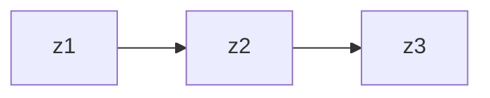

#  用于序列标注的隐马尔可夫模型

> [如何用简单易懂的例子解释隐马尔可夫模型？ - 知乎 - 作者：Yang Eninala](https://www.zhihu.com/question/20962240) 
>
> [NLP实战-中文命名实体识别](https://mp.weixin.qq.com/s/k9njcx_11ELsmfH1mGO28Q)
>
> [luopeixiang/named_entity_recognition: 中文命名实体识别（包括多种模型：HMM，CRF，BiLSTM，BiLSTM+CRF的具体实现）](https://github.com/luopeixiang/named_entity_recognition)

## 直观理解


上面三种不同的骰子，假设我手里有三个不同的骰子。第一个骰子是我们平常见的骰子（称这个骰子为D6），6个面，每个面（1，2，3，4，5，6）出现的概率是1/6。第二个骰子是个四面体（称这个骰子为D4），每个面（1，2，3，4）出现的概率是1/4。第三个骰子有八个面（称这个骰子为D8），每个面（1，2，3，4，5，6，7，8）出现的概率是1/8。

假设我们开始掷骰子，先从三个骰子里面选一个，概率为 1/3，然后掷骰子得到一个数字，反复几次，我们可以得到一串数字 [1, 6, 2, 3]

这串数字叫做**观测序列（可见状态链）**，我们不仅仅有这么个观测序列，还有一串**状态序列**（HMM中说到的马尔可夫链其实是指**隐含状态链**），比如 [D4, D6, D8, D8]，在我们这个例子里，D4 的下一个状态是 D4，D6，D8 的概率都是1/3。我们其实是可以随意设定转换概率的。比如，我们可以这样定义，D6后面不能接D4，D6后面是D6的概率是0.9，是D8的概率是0.1。这样就是一个新的HMM。

```python
'状态序列' -> '观测序列'
[D4,D6,D8,D8] -> [1, 6, 2, 3]
```

​	若观测序列为：[1 6 3 5 2 7 3 5 2 4]，状态序列为 [D6 D8 D8 D6 D4 D8 D6 D6 D4 D8]，则：


> 其实对于HMM来说，如果提前知道所有隐含状态之间的转换概率和所有隐含状态到所有可见状态之间的输出概率，做模拟是相当容易的。但是应用HMM模型时候呢，往往是缺失了一部分信息的，有时候你知道骰子有几种，每种骰子是什么，但是不知道掷出来的骰子序列；有时候你只是看到了很多次掷骰子的结果，剩下的什么都不知道。如果应用算法去估计这些缺失的信息，就成了一个很重要的问题。

---

隐马尔可夫模型是一种概率图模型。HMM模型中存在两个假设，一是输出观察值之间严格独立，二是状态转移过程中当前状态只与前一状态有关。

我们知道，机器学习模型可以从频率派和贝叶斯派两个方向考虑，在频率派的方法中的核心是优化问题，而在贝叶斯派的方法中，核心是积分问题，也发展出来了一系列的积分方法如变分推断，MCMC 等。概率图模型最基本的模型可以分为有向图（贝叶斯网络）和无向图（马尔可夫随机场）两个方面，例如 GMM，在这些基本的模型上，如果样本之间存在关联，可以认为样本中附带了时序信息，从而样本之间不独立全同分布的，这种模型就叫做动态模型，隐变量随着时间发生变化，于是观测变量也发生变化：



（《统计学习方法》） 隐马尔可夫模型（Hidden Markov Model，HMM）是关于时序的概率模型，描述由一个隐藏的马尔可夫链随机生成不可观测的状态随机序列，再由各个状态生成一个观测而产生观测随机序列的过程。隐藏的马尔可夫链随机生成的状态的序列，称为**状态序列**（state sequence）；每个状态生成一个观测，而由此产生的观测的随机序列，称为**观测序列**（observation sequence）。序列的每一个位置又可以看作是一个时刻。

Q 是所有可能的状态集合，V 是所有可能观测的集合，N, M 分别是其数量：
$$
Q=\left\{q_{1}, q_{2}, \cdots, q_{N}\right\}, \quad V=\left\{v_{1}, v_{2}, \cdots, v_{M}\right\}
$$

在这里，Q = {1, 2, 3, 4, 5, 6, 7, 8}，V = {D4, D6, D8}

I是长度为T的状态序列（如 [D6 D8 D8 D6 D4 D8 D6 D6 D4 D8]），O是对应的观测序列（如  [1 6 3 5 2 7 3 5 2 4]）。
$$
I=\left(i_{1}, i_{2}, \cdots, i_{T}\right), \quad O=\left(o_{1}, o_{2}, \cdots, o_{T}\right)
$$
A 是状态转移概率矩阵 $A=[a_{ij}]_{N\times N}$​​ ，其中 
$$
a_{ij} = P(i_{t+1}=q_j |i_t = q_i),i=1,2,\cdots,N;j=1,2,\cdots,N
$$
是在时刻 $t$ 处于状态 $q_i$ 条件下，在时刻 $t + 1$ 转移到状态 $q_j$​ 的概率。

B 是观测概率矩阵 $B=[b_{j}(k)]_{N\times M}$​，其中
$$
b_{j}(k)=P\left(o_{t}=v_{k} \mid i_{t}=q_{j}\right), \quad k=1,2, \cdots, M ; j=1,2, \cdots, N
$$
是时刻 $t$ 下状态 $q_j$ 条件下，生成观测 $v_k$ 的概率。

$\pi$​ 是初始状态的概率向量 $\pi=(\pi_i)$​，其中
$$
\pi_i = P(i_1=q_i), i=1,2,\cdots,N
$$
是 $t = 1$ 时处于状态 $q_i$ 的概率。如 $\pi =[0.3, 0.3,0.4]^\top$ 分别对应 $ V = \{D4, D6, D8\}$

隐马尔可夫模型由**初始状态概率向量**，**状态转移概率矩阵**以及**观测概率矩阵**所确定。

$\pi$ 和 $A$ 决定状态序列，$B$ 决定观测序列。因此 隐马尔可夫模型 $\lambda$​ 可以用三元符号表示，即
$$
\lambda=(A,B,\pi)
$$

---

上面的定义太过学术看不懂没关系，我们只需要知道，NER本质上可以看成是一种序列标注问题（预测每个字的BIOES标记），在使用HMM解决NER这种序列标注问题的时候，我们所能观测到的是**字组成的序列**（观测序列），观测不到的是**每个字对应的标注**（状态序列）。

HMM 的三个状态可以解释为：

- **初始状态分布** 是每一个标注作为句子第一个字的标注的概率；
- **状态转移概率矩阵** 就是由某一个标注转移到下一个标注的概率；设状态转移矩阵为 $M$​，则若前一个词标注为 ${tag}_i$​，则当前词为 ${tag}_j$​ 的概率为 $M_{ij}$​
- **观测概率矩阵** 就是指在某个标注下，生成某个词的概率。

HMM 模型的训练过程对应隐马尔可夫模型的学习问题（李航 统计学习方法），实际上就是根据训练数据根据**最大似然**的方法估计模型的三个要素，即上文提到的初始状态分布、状态转移概率矩阵以及观测概率矩阵。

举个例子帮助理解，在估计初始状态分布的时候，假如某个标记在数据集中作为句子第一个字的标记的次数为 k，句子的总数为 N，那么该标记作为句子第一个字的概率可以近似估计为`k/N`，很简单对吧，使用这种方法，我们近似估计HMM的三个要素，代码如下

```python
class HMM(object):
    def __init__(self, N, M):
        """
        Args:
            N: 状态数，这里对应存在的标注的种类
            M: 观测数，这里对应有多少不同的字
        """
        self.N = N
        self.M = M

        # 状态转移概率矩阵 A[i][j]表示从i状态转移到j状态的概率
        self.A = torch.zeros(N, N)
        # 观测概率矩阵, B[i][j]表示i状态下生成j观测的概率
        self.B = torch.zeros(N, M)
        # 初始状态概率  Pi[i]表示初始时刻为状态i的概率
        self.Pi = torch.zeros(N)
        
    def train(self, word_lists, tag_lists, word2id, tag2id):
        """
        HMM的训练，即根据训练语料对模型参数进行估计,
           因为我们有观测序列以及其对应的状态序列，所以我们
           可以使用极大似然估计的方法来估计隐马尔可夫模型的参数
        参数:
            word_lists: 列表，其中每个元素由字组成的列表，如 ['担','任','科','员']
            tag_lists: 列表，其中每个元素是由对应的标注组成的列表，如 ['O','O','B-TITLE', 'E-TITLE']
            word2id: 将字映射为ID
            tag2id: 字典，将标注映射为ID
        """

        assert len(tag_lists) == len(word_lists)

        # 估计转移概率矩阵
        for tag_list in tag_lists:
            seq_len = len(tag_list)
            for i in range(seq_len - 1):
                current_tagid = tag2id[tag_list[i]]
                next_tagid = tag2id[tag_list[i+1]]
                self.A[current_tagid][next_tagid] += 1
        # 问题：如果某元素没有出现过，该位置为0，这在后续的计算中是不允许的
        # 解决方法：我们将等于0的概率加上很小的数
        self.A[self.A == 0.] = 1e-10
        self.A = self.A / self.A.sum(dim=1, keepdim=True)

        # 估计观测概率矩阵
        for tag_list, word_list in zip(tag_lists, word_lists):
            assert len(tag_list) == len(word_list)
            for tag, word in zip(tag_list, word_list):
                tag_id = tag2id[tag]
                word_id = word2id[word]
                self.B[tag_id][word_id] += 1
        self.B[self.B == 0.] = 1e-10
        self.B = self.B / self.B.sum(dim=1, keepdim=True)

        # 估计初始状态概率
        for tag_list in tag_lists:
            init_tagid = tag2id[tag_list[0]]
            self.Pi[init_tagid] += 1
        self.Pi[self.Pi == 0.] = 1e-10
        self.Pi = self.Pi / self.Pi.sum()
        
```

## 维特比算法 (viterbi)

> [掌握动态规划，助你成为优秀的算法工程师 | 机器之心](https://www.jiqizhixin.com/articles/2019-09-29-5)

维特比算法实际是用动态规划解隐马尔可夫模型预测问题，即用动态规划（dynamic programming）求概率最大路径（最优路径）。这时一条路径对应着一个**状态序列**。也是一种图最短路算法——针对篱笆网络（Lattice Network）这一特殊的有向无环图。时间复杂度为 $NM^2$


如上图所示，这是一个部分的篱笆网络，中间我们假设有 $N$​ 列，每列有 $4$​ 个节点，节点之间的权重我们暂时忽略。这个时候，网络的最左边有一个节点为 $S$​，最右端有一个节点为 $E$​ 。如果我想求$S$​ 到 $E$​  之间的最短路径，理所当然，我们如果穷举出所有的路径进行比较，也就是 $4^N$​ 条路径，自然可以得到结果，但如果层数很多或者每层的节点数很多的时候，这种方法就显得不够友好了。

既然穷举法太过暴力，自然我们想试试能不能用动态规划来解决。

首先，篱笆网络有这么一个特点，就是假设我们从第一列走到最后一列，我们一定会经过其中的第 $i$ 时刻的某个节点。这个当然是显而易见的，但给我们带来了一个好处，那就是当我们计算最终的最短路径时，假设第 $i$ 列有 $k$ 个节点，如果我们已经计算了从开头到第 $i$ 列所有$k$ 个节点的最短路径，那最终的最短路径一定是经过其中之一。

第二，如果说最短路径P经过某个节点 $x_{ij}$ ，那么从起始节点$S$ 到节点 $x_{ij}$ 的这段子路径 $Q$，一定是从起始节点$S$ 到 $x_{ij}$ 的最短路径，否则总路径 $P$ 也不再是最短路径，这就自相矛盾了。

有了这两个特性，终于可以试试动态规划了。同样我们从最左边的S节点出发，到第1列的4个节点，因为各只有一段距离，那自然这4个距离 $d(S, x_{1i})$ 为 $S$ 节点到这4个节点的最短距离。当我们走到第 2 列时，根据之前的特性，一定会经过第1列的某个节点。此时的S节点到第2列某个节点的距离则为 $d(S, x_{2j})=d(S, x_{1i}) + d(x_{1i}, x_{2j})$ 。而第1列有4个节点，所以 $d(S, x_{2j})$​ 应该是取4个距离中的最小值，当然在这一过程中，我们计算了4次，对于第2列的每个节点，我们都去进行如上的计算。所以在从第1列走到第2列的过程中，我们计算了4×4次，更关键的是我们把 $ d(S, x_{2j})$都要保存下来，作为我们下一次计算的基础。

而这个保存中间结果的过程，很明显地体现出了前文所述的动态规划的特点。接下来，我们继续走到第3列，同样的，S节点到第3列某个节点的距离为$d(S, x_{3k})=d(S, x_{2j}) + d(x_{2j}, x_{3k})$​​。

这个时候我们发现，等式右边的第一项，可以直接取我们刚刚保存的中间结果。对于 $d(S, x_{3k})$​​​，我们依然是计算4次，取最小值保存下来。同样，需要遍历第 $3$​​​ 列的 $4$​​​ 个节点，所以又是 $4×4$​​​次计算。也就是说，每往前走1列，我们就计算了$4×4$​ 次。以此类推，到最右边的节点E的时候，我们需要计算$N×4^2$​次，相比于穷举法的 $4^N$​​​ 条路径，这个效率已经是非常大的进步，把指数级的复杂度降低到了多项式级别！

```python
class HMM:
    #...
    
    def decoding(self, word_list, word2id, tag2id):
        """
        使用维特比算法对给定观测序列求状态序列， 这里就是对字组成的序列,求其对应的标注。
        维特比算法实际是用动态规划解隐马尔可夫模型预测问题，即用动态规划求概率最大路径（最优路径）
        这时一条路径对应着一个状态序列
        """
        # 问题:整条链很长的情况下，十分多的小概率相乘，最后可能造成下溢
        # 解决办法：采用对数概率，这样源空间中的很小概率，就被映射到对数空间的大的负数
        #  同时相乘操作也变成简单的相加操作
        A = torch.log(self.A)
        B = torch.log(self.B)
        Pi = torch.log(self.Pi)

        # 初始化 维比特矩阵viterbi 它的维度为[状态数, 序列长度]
        # 其中viterbi[i, j]表示标注序列的第j个标注为i的所有单个序列(i_1, i_2, ..i_j)出现的概率最大值
        seq_len = len(word_list)
        viterbi = torch.zeros(self.N, seq_len)
        # backpointer是跟viterbi一样大小的矩阵
        # backpointer[i, j]存储的是 标注序列的第j个标注为i时，第j-1个标注的id
        # 等解码的时候，我们用backpointer进行回溯，以求出最优路径
        backpointer = torch.zeros(self.N, seq_len).long()

        # self.Pi[i] 表示第一个字的标记为i的概率
        # Bt[word_id]表示字为word_id的时候，对应各个标记的概率
        # self.A.t()[tag_id]表示各个状态转移到tag_id对应的概率

        # 所以第一步为
        start_wordid = word2id.get(word_list[0], None)
        Bt = B.t()
        if start_wordid is None:
            # 如果字不再字典里，则假设状态的概率分布是均匀的
            bt = torch.log(torch.ones(self.N) / self.N)
        else:
            bt = Bt[start_wordid]
        viterbi[:, 0] = Pi + bt
        backpointer[:, 0] = -1

        # 递推公式：
        # viterbi[tag_id, step] = max(viterbi[:, step-1]* self.A.t()[tag_id] * Bt[word])
        # 其中word是step时刻对应的字
        # 由上述递推公式求后续各步
        for step in range(1, seq_len):
            wordid = word2id.get(word_list[step], None)
            # 处理字不在字典中的情况
            # bt是在t时刻字为wordid时，状态的概率分布
            if wordid is None:
                # 如果字不再字典里，则假设状态的概率分布是均匀的
                bt = torch.log(torch.ones(self.N) / self.N)
            else:
                bt = Bt[wordid]  # 否则从观测概率矩阵中取bt
            for tag_id in range(len(tag2id)):
                max_prob, max_id = torch.max(
                    viterbi[:, step-1] + A[:, tag_id],
                    dim=0
                )
                viterbi[tag_id, step] = max_prob + bt[tag_id]
                backpointer[tag_id, step] = max_id

        # 终止， t=seq_len 即 viterbi[:, seq_len]中的最大概率，就是最优路径的概率
        best_path_prob, best_path_pointer = torch.max(
            viterbi[:, seq_len-1], dim=0
        )

        # 回溯，求最优路径
        best_path_pointer = best_path_pointer.item()
        best_path = [best_path_pointer]
        for back_step in range(seq_len-1, 0, -1):
            best_path_pointer = backpointer[best_path_pointer, back_step]
            best_path_pointer = best_path_pointer.item()
            best_path.append(best_path_pointer)

        # 将tag_id组成的序列转化为tag
        assert len(best_path) == len(word_list)
        id2tag = dict((id_, tag) for tag, id_ in tag2id.items())
        tag_list = [id2tag[id_] for id_ in reversed(best_path)]

        return tag_list
```


