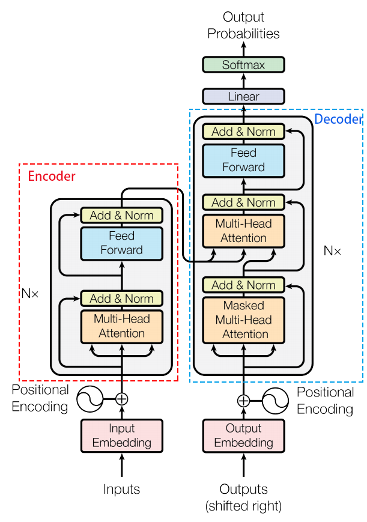

# Transformer 细枝末节

本文翻译自哈佛NLP[The Annotated Transformer](https://nlp.seas.harvard.edu/2018/04/03/attention.html) 本文主要由Harvard NLP的学者在2018年初撰写。

# 模型整体



这张图都用烂了，原创来自 http://jalammar.github.io/illustrated-transformer/

Transformer最开始提出来解决机器翻译任务，因此是seq2seq模型的一种。

如下图，可以将 Transformer 看成是黑盒：


将法语翻译为英语。


他用了 6 层编码器和 6 层解码器，将 Input 输入通过 6 层抽象之后，将最后一层分别传入解码器的 6 层。

## Encoder

### 输入了什么

输入的是 **词向量 + 位置向量**

### 词向量

词向量和其他的 seq2seq 方法是一样的，lup 就是 look-up table 查找表 [[1608.05859] Using the Output Embedding to Improve Language Models](https://arxiv.org/abs/1608.05859)。还要让对应的词向量乘以 $\sqrt{d_{model}}$。 transformer 规定的词向量维度是
$$
d_{model} = 512
$$

```python
class Embeddings(nn.Module):
    def __init__(self, d_model, vocab):
        super(Embeddings, self).__init__()
        self.lut = nn.Embedding(vocab, d_model)
        self.d_model = d_model

    def forward(self, x):
        return self.lut(x) * math.sqrt(self.d_model)
```


### 位置编码

不包含循环和卷积，为了让模型利用序列的顺序，我们必须加入一些序列中token的相对或者绝对位置的信息。为此，我们将“位置编码”添加到编码器和解码器堆栈底部的输入embeddinng中。位置编码和 embedding 的维度相同，也是$d_{\text{model}}$ , 所以这两个向量可以相加。有多种位置编码可以选择，例如通过学习得到的位置编码和固定的位置编码。

transformer 使用的是不同频率的正弦和余弦函数
$$
\mathrm{PE}_{(\mathrm{pos}, 2 \mathrm{i})}=\sin \left(\operatorname{pos} / 10000^{2 \mathrm{i} / \mathrm{d}_{\text {model }}}\right)\\\mathrm{PE}_{(\mathrm{pos}, 2 \mathrm{i}+1)}=\cos \left(\operatorname{pos} / 10000^{2 \mathrm{i} / \mathrm{d}_{\text {model }}}\right)
$$
其中 pos 是位置，i 是维度。也就是说，位置编码的每个维度对应于一个正弦曲线。 这些波长形成一个从 $2π$ 到 $10000 \cdot 2\pi$  的集合级数。我们选择这个函数是因为我们假设它会让模型很容易学习对相对位置的关注，因为对任意确定的偏移 k, $PE_{pos+k}$  可以表示为 $PE_{pos}$ 的线性函数。

此外，我们会将编码器和解码器堆栈中的 embedding 和位置编码的和再加一个 dropout 。对于基本模型，我们使用的dropout比例是$P_{drop}=0.1 $。

```python
class PositionalEncoding(nn.Module):
    "Implement the PE function."
    def __init__(self, d_model, dropout, max_len=5000):
        super(PositionalEncoding, self).__init__()
        self.dropout = nn.Dropout(p=dropout)
        
        # Compute the positional encodings once in log space.
        pe = torch.zeros(max_len, d_model)
        position = torch.arange(0, max_len).unsqueeze(1)
        div_term = torch.exp(torch.arange(0, d_model, 2) * -(math.log(10000.0) / d_model))
        # 切片表达式
        pe[:, 0::2] = torch.sin(position * div_term)
        pe[:, 1::2] = torch.cos(position * div_term)
        pe = pe.unsqueeze(0)
        self.register_buffer('pe', pe)
        
    def forward(self, x):
        x = x + Variable(self.pe[:, :x.size(1)], 
                         requires_grad=False)
        return self.dropout(x)
```

### 逐层分解

编码器由N = 6个完全相同的层组成。

```python
def clones(module, N):
    "产生N个完全相同的网络层"
    "Produce N identical layers."
    return nn.ModuleList([copy.deepcopy(module) for _ in range(N)])
```

```python
class Encoder(nn.Module):
    "完整的Encoder包含N层"
    def __init__(self, layer, N):
        super(Encoder, self).__init__()
        self.layers = clones(layer, N)
        self.norm = LayerNorm(layer.size)
        
    def forward(self, x, mask):
        "每一层的输入是x和mask"
        for layer in self.layers:
            x = layer(x, mask)
        return self.norm(x)
```

编码器的每层encoder包含Self Attention 子层和FFNN子层，每个子层都使用了残差连接[(cite)](https://arxiv.org/abs/1512.03385)，和层标准化（layer-normalization） [(cite)](https://arxiv.org/abs/1607.06450)。

先实现一下层标准化，虽然是 pytorch 自带的：

```python
class LayerNorm(nn.Module):
    "Construct a layernorm module (See citation for details)."
    def __init__(self, features, eps=1e-6):
        super(LayerNorm, self).__init__()
        self.a_2 = nn.Parameter(torch.ones(features))
        self.b_2 = nn.Parameter(torch.zeros(features))
        self.eps = eps

    def forward(self, x):
        mean = x.mean(-1, keepdim=True)
        std = x.std(-1, keepdim=True)
        return self.a_2 * (x - mean) / (std + self.eps) + self.b_2
```

我们称呼子层为：$\mathrm{Sublayer}(x)$，每个子层的最终输出是$\mathrm{LayerNorm}(x + \mathrm{Sublayer}(x)) $ 。 dropout [(cite)](http://jmlr.org/papers/v15/srivastava14a.html)被加在Sublayer上

下面的SublayerConnection类用来处理单个Sublayer的输出，该输出将继续被输入下一个Sublayer：

```python
class SublayerConnection(nn.Module):
    """
    A residual connection followed by a layer norm.
    Note for code simplicity the norm is first as opposed to last.
    """
    def __init__(self, size, dropout):
        super(SublayerConnection, self).__init__()
        self.norm = LayerNorm(size)
        self.dropout = nn.Dropout(dropout)

    def forward(self, x, sublayer):
        "Apply residual connection to any sublayer with the same size."
        return x + self.dropout(sublayer(self.norm(x)))
```
