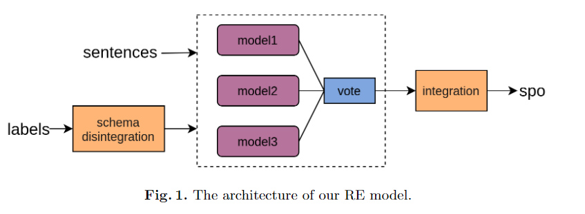

https://github.com/neukg/MultiIE

https://www.jiqizhixin.com/articles/2020-07-29-4

Code for "A Simple but Effective System for Multi-format Information Extraction"(NLPCC 2021) and [LIC-2021](https://aistudio.baidu.com/aistudio/competition/detail/65?isFromLuge=true&lang=zh_CN)（2021语言与智能技术竞赛：多形态信息抽取任务）.

2021 语言与智能挑战赛中的多格式信息提取任务旨在从不同维度综合评估信息提取。 它由一个多槽关系提取子任务和两个从句子级和文档级提取事件的事件提取子任务组成。 在这里，我们描述了我们用于这种多格式信息提取竞争任务的系统。 具体来说，对于关系提取子任务，我们将其转换为传统的三元组提取任务，并设计了一种充分利用现有模型的基于投票的方法。 对于句子级事件提取子任务，我们将其转换为 NER 任务并使用基于指针标记的方法进行提取。 此外，考虑到注释的触发信息可能有助于事件提取，我们设计了一个辅助触发识别模型，并使用多任务学习机制将触发特征集成到事件提取模型中。 对于文档级事件提取子任务，我们设计了一种基于 Encoder-Decoder 的方法，并提出了一种类似 Transformer 的解码器。 最后，我们的系统在这个多格式信息提取任务的测试集排行榜上排名第4，其在关系提取、句子级和文档级事件提取子任务的F1分数分别为79.887%、85.179 % 和 70.828%。

## Introduction

信息抽取(Information extraction, IE)旨在从非结构化文本中提取结构化知识。命名实体识别(NER)、关系抽取(RE)和事件抽取(EE)是分别关注实体、关系和事件的基本信息抽取任务。然而，大多数研究都只关注于单一格式的信息提取，缺乏统一的不同格式的信息提取方法的IE评估平台。因此，LIC-2021 设立了一个多格式的IE竞赛任务，旨在从不同维度全面评估IE。该任务由一个关系提取子任务和两个从句子级和文档级提取事件的事件提取子任务组成。这些子任务的定义如下：

### 命名实体识别

命名实体识别 (named-entity-recognition) ：命名实体识别(NER)的任务是找到文本中提到的每个命名实体，并标记其类型。构成命名实体类型的是特定于任务的;人员、地点和组织是常见的。一旦提取了文本中的所有命名实体，就可以将它们链接到与实际实体相对应的集合中。

### 关系抽取

目标根据预定义的模式集，从给定句子中提取所有 SPO 三元组的任务。 

模式集定义了关系 P 及其对应的主语 S 和客体 O 的类型。根据客体 O 的复杂程度，有两种模式。 

第一个是单 O 值模式，其中对象 O 仅获取单个 slot 和值。 例如：

```python
{
    S_TYPE: 人物,
    P: 妻子,
    O_TYPE: {
        @value: 人物
	}
}
```

句子：新垣结衣和星野源在今年结婚了

```python
{
    S: 新垣结衣,
    P: 妻子,
    O: {
        @value:星野源
	}
}
```


第二个多元 O 值，其中对象 O 是一个由多个 slot 及其对应值组成的结构。

> 也就是说 O 是一个结构体，由多个语义明确的文本共同组成，多个文本对应了结构体中的多个槽位（slot）。在复杂 O 值类型的定义中，@value 槽位可以认为是该关系的默认 O 值槽位，对于该关系不可或缺，其他槽位均可缺省。例如，「饰演」关系中 O 值有两个槽位 @value 和 inWork，分别表示「饰演的角色是什么」以及「在哪部影视作品中发生的饰演关系」，其 schema 定义为：

```python
schema_play = 

{
    S_TYPE: 娱乐人物,
    P: 饰演,
    O_TYPE: {
        @value: 角色
        inWork: 影视作品
    }
} 
```

- **输入/输出**：
  - 输入：schema 约束集合及句子 sentence
  - 输出： 句子sent中包含的符合给定 schema 约束的三元组知识 Triples

> 输入：
>
> ```python
> schema_play = {
>     S_TYPE: 娱乐人物,
>     P: 饰演,
>     O_TYPE: {
>         @value: 角色
>         inWork: 影视作品
>     }
> } 
> 句子 = "吴亦凡在《监狱风云4》中扮演了一个强奸犯。"
> ```
>
> 输出：
>
> ```python
> {
>  S: 吴亦凡,
>  P: 饰演,
>  O: {
>      @value: 强奸犯
>      inWork: 《监狱风云4》
>  }
> } 
> ```


> 注：
>
> 关系抽取，对识别出来的实体构建对应的关系，两者便是构建三元组的基本组成，寻找和分类命名体之间的语义关系。比如“小明的爸爸是王刚”，就可以抽取出关系三元组 `[王刚, 父子, 小明]`。(**subject, relation, object**)
>
> 实体关系抽取是指从一个句子中抽取出关系三元组（entity1, relation, entity2）,例如，‘’任正非在深圳创办了华为公司。‘’，其中任正非是实体1，华为是实体2，它们之间的关系是创办，那么抽取的三元组为（任正非，创办，华为）。
>
> 在以往的研究工作中，早期两个任务以 pipline 的方式进行，先做命名实体识别，然后做关系抽取。但是pipline的流程可能造成实体的识别错误，也就造成关系构建的错误，所以后续的一些研究工作将两者采用联合学习的方式。

### 事件抽取

由两个子任务组成。 第一个是句子级事件（SEE, sentence level event）提取，其目的是给定一个句子和具有相应参数角色的预定义事件类型，以识别句子中提到的所有目标类型的事件，并提取相应的扮演目标角色的事件参数。 预定义的事件类型和参数角色限制了提取的范围。 第二个是文档级事件（DEE, document-level event）提取任务，它与前一个共享几乎相同的定义，但在文档级而不是句子级考虑输入文本片段，并将事件类型限制为 提取于金融领域。

| 任务           | 模式例子                                                     |
| -------------- | ------------------------------------------------------------ |
| 关系抽取       | subject type: 娱乐人物<br/>object type: {inWork: 影视作品,<br/>@value: 角色} <br/>predicate: 饰演 |
| 句子级事件抽取 | event type: 金融/交易限价下调<br/>role list: [role: 时间, role: 跌至极限的股票] |
| 文档级事件抽取 | event type: 被面试<br/>role list: [role: 面试的公司名,<br/>role: 给结果的时间,<br/>role: 面试的时间,<br/>role: 面试机构] |


表 1 展示了这些子任务的一些模式示例。 例如，在给定的多 O 值模式关系抽取示例中，对象由两个项组成：inWork 和 @value，但在此示例中传统 RE 可能只获取 @value 项。 与传统的单格式IE任务相比，LIC-2021设计的多格式IE任务存在以下挑战

首先，尽管现有**联合实体和关系提取方法**取得了成功，但由于多 O 值模式关系，**它们不能直接应用于 LIC-2021 中的多 slot 的 RE 任务。** 

其次，由于重叠事件角色问题，事件提取更具挑战性：**一个论元可能有多个角色**。

此外，在给定的数据集中**提供了带注释的触发词**，如何有效地使用这种触发词信息仍然是一个悬而未决的问题。

第三，**在DEE子任务中难以提取具有相同事件类型的不同事件**。 例如，对于表 1 所示的“被采访”事件类型，可能在不同时间采访了不同的人。 对于这种情况，在 SEE 子任务中，两个不同时间的论点和两个受访者被视为同一事件的论点。 但是，这两个论元需要归类为 DEE 子任务中两个不同事件的论元。

在我们的系统中，我们使用了一些有效的方法来克服这些挑战。 

具体来说，对于第一个，我们设计了一个模式分解模块，将每个多 O 值关系转换为几个单 O 值关系，然后使用基于投票的模块来获得最终关系。将SEE子任务转换为NER任务，并使用基于指针标记的方法解决上述重叠问题。为了利用触发信息，我们设计了一个辅助的触发识别模块，并利用多任务学习机制对触发信息进行集成。针对第三个问题，我们设计了一种基于编码器-解码器的方法来生成不同的事件。

## 相关工作

RE 是一项长期存在的自然语言处理任务，其目的是从自由文本中挖掘事实三元组知识。 这些三元组具有(S, P, O)的形式，其中S和O都是实体，P是一种连接S和O的语义关系。例如，一个三元组（北京，首都，中国）可以表示 知道北京是中国的首都。 目前，以端到端的方式联合提取实体和关系的方法占主导地位。 根据所采取的提取路线，这些联合提取方法可以大致分为以下三类。 

(i) 基于表格填充的方法（[3,12]），为每个关系维护一个表格，表格中的每个项目用于指示行词和列词是否具有对应关系。 

(ii) 基于标记的方法 ([4,16])，它使用基于序列标记的方法来标记实体和关系。 

(iii) 基于 Seq2seq 的方法 ([19,18])，使用基于序列生成的方法以预定义的顺序生成每个三元组中的项目，例如，首先生成 S，然后是 P，然后是 O 等。

根据输入的文本，事件提取（EE）可以分为句子级EE（SEE）和文档级EE（DEE）。 大多数现有的 EE 研究（如 [1] 和 [13]）都集中在 SEE 上。 通常，他们使用基于 pipline 的框架，首先预测触发词，然后预测参数。 最近，DEE 越来越受到关注。 通常在 DEE 中存在两个主要挑战，即：

（i）一个事件的论元可能分散在文档的某些长距离句子甚至不同的文档中，以及（ii）每个文档可能包含多个事件。 具有代表性的中国 DEE 工作是 [17]，其 DEE 模型包含两个主要组成部分：一个从句子中提取事件参数和事件触发词的 SEE 模型； 以及基于关键事件检测模型和参数完成策略从整个文档中提取事件参数的 DEE 模型。 另一个具有代表性的中文 DEE 工作是 [20]，它使用基于实体的有向无环图来有效地完成 DEE 任务。 此外，他们使用无触发词设计重新定义了 DEE 任务，以简化文档级事件标记。 这两项 DEE 工作都是在中国金融领域进行评估的。

## 方法

### 关系抽取



我们的RE模型的架构如图1所示。我们可以看到，它由两个主要模块组成:模式分解模块和投票模块。

一个多元O值三元组 $\{ {\rm s, p}, [(o_{k1}, o_{v1}), ..., (o_{km} , o_{vm} )]\}$ ，模式分解模块将其按如下方法分解。

$o_{v1}$ 被当成一个 object 来生成三元组：$\{{\rm s, p}, o_{v1}\}$

然后 i = 2，每一个 $(o_{ki}, o_{vi})$ 都会生成两个三元组 $\{\rm s, p \text{-}  o_{ki}, o_{vi}\}, \{o_{v1}, o_{ki}, o_{vi}\}$

$s$ 和 $o_{v1}$ 会在形成的三元组中被反复当作主体。
$$
\{s, p, o_{v1}\}, \{s, p\text{-}o_{k2}, o_{v2}\}, \{o_{v1}, o_{k2}, o_{v2}\}, ..., \{s, p\text{-}o_{km} , o_{vm} \}, \{o_{v1}, o_{km} , o_{vm} \}
$$
如果有一些单o值三元组，它们可以通过一个反向过程形成多o值三元组

在投票模块中，三个现有的最先进的三元组提取模型用于分别提取单 O 值三元组。 然后他们的结果将被投票输出获得更多投票的三元组。 接下来，这些获得的三元组被转换成一些多 O 值的三元组，作为这个 RE 任务的最终结果。 在我们的系统中，以下三个现有的最先进模型用于投票：TPLinker [14]、SPN [10] 和 CasRel [16]

```python
schema_play = {
    S_TYPE: 娱乐人物,
    P: 饰演,
    O_TYPE: {
        @value: 角色
        inWork: 影视作品
    }, {
        @value: 演员
        inWork: 脱口秀
    }
} 

{娱乐人物， 饰演， 角色}， {娱乐人物，饰演角色，影视作品}，{娱乐人物，饰演，演员}，{影视作品， 演员，脱口秀}

```

### 句子级事件抽取

> 事件作为信息的一种表现形式，其定义为特定的人及物在特定的时间特定的地点相互作用的事实。事件的组成元素包含触发词、事件类型、论元以及论元角色：
>
> - **触发词 (trigger)**：事件发生的核心词，多为动词和名词。
> - **事件类型 (event type)**：ACE2005 定义了8种事件类型和33种子类型。其中，大多数事件抽取均采用33 种事件类型。与触发词相对应，往往可以通过触发词分类加以识别
> - **论元 (argument)**：事件的具体参与者。
> - **论元角色 (role)**：事件论元在事件中充当的角色。共有35类角色，例如，攻击者 、受害者等。
>
> 在Baghdad，当一个美国坦克对着 Palestine 酒店开火时一个摄影师死去了。该事件信息如表1所示：
>
> 
>
> 事件抽取的目标即自动化的从非结构化的信息中完成上述信息的获取，并结构化进行展示。事件抽取是信息抽取领域中一项重要且具有挑战性的任务。其可以为知识库构建，问答以及语言理解任务提供有效的结构化信息。然而传统的事件抽取任务大多数基于句子层面，但是这样具有很明显的缺陷：一个事件会涉及到触发词和多个论元，但是实际情况中，很少会有触发词和所有的论元都出现在一个句子中的理想情况（如图1[1]），所以如果在实际的文本中，孤立的从单个句子抽取，很可能会得不到完整的事件信息。因此，研究文档级别的事件抽取，如何获取跨句子的信息，对事件抽取的实际应用是很有帮助的。

在我们的系统中，我们**将每个事件论元视为一个实体**，并将该论元对应的**事件类型和角色连接起来作为实体类型**。然后SEE任务转换为NER任务。但是在SEE任务中存在多个标签问题:一个论元可能属于多个事件类型。为了解决这个问题，这里我们使用一个基于指针标记的 NER 方法，为每个候选实体类型标记实体跨度的开始标记和结束标记。具体来说，如Eq.(1)所示，对于每个实体类型，模型为每个单词计算两个概率，以表示这个w的可能性
$$
\begin{aligned}
&p_{s_{i j}}=\operatorname{sigmoid}\left(W_{i}^{S} h_{j}+b_{i}^{S}\right) \\
&p_{e_{i j}}=\operatorname{sigmoid}\left(W_{i}^{E} h_{j}+b_{i}^{E}\right)
\end{aligned}
$$
$\text { where }\left\{W_{i}^{(.)} \in \mathbb{R}^{d}\right\}_{i=1}^{r},\left\{b_{i}^{(.)} \in \mathbb{R}\right\}_{i=1}^{r}$ 是第 i 个实体类型的可学习参数， hj ∈ Rd 是第 j 个单词的标记表示，由预训练语言模型获得，r 是实体类型的数量，psij 和 peij 是 j 的概率 -th word 是应标记为第 i 个实体类型的实体的开始标记和结束标记。

此外，为了充分利用注释触发词的特征，我们设计了一个辅助触发词识别模块，该模块也以与上述相同的 NER 方式识别触发词。 该辅助模块与上述参数识别模块以**多任务学习的方式联合训练**。

在训练期间，触发词识别模块将为每个触发词生成一个表示。 然后这些触发表示将被合并到参数识别模块使用的标记表示中，并有注意力机制，用于下一次迭代的参数识别。 

但是在推理过程中，我们的模型将首先识别所有触发词（结果表示为 $T = \{t1,t2,... \}$）。 然后这些触发词的表示将通过**最大池化**操作融合成一个统一的表示（表示为 t）。 接下来，使用基于附加注意的方法获得新的标记表示序列（表示为 $\hat{H}$），然后将其用作参数识别模块的输入。 具体来说，$\hat H$ 计算如下：
$$
\begin{aligned}
&\alpha=\operatorname{softmax}\left(V^{\mathrm{T}} \tanh \left(W_{1} H+W_{2} t\right)\right) \\
&\hat{H}=\alpha \cdot H
\end{aligned}
$$
其中H为原始 token 表示，V, W1, W2 为可学习参数，上标T表示矩阵转置操作。

### 文档级事件提取

我们的DEE模型的架构如图2所示。我们可以看到它包含三个主要模块，分别是Encoder、Decoder和Output。


BERT 和 它的一些变体用作编码器来获取文档中每个标记的**上下文感知表示**。 请注意，BERT 及其变体对输入文本都有长度限制（通常为 512 个 TOKEN），因此我们使用基于滑动窗口的方法将长文档拆分为多个段。 然后将每个段作为输入由我们的 DEE 模型进行处理，并将这些段的结果组合为最终结果。 给定一个段 $S = \{e0,e1,...,el\}$，Encoder 的输出是一个标记嵌入序列，我们将其表示为 $H∈\R^{l×d}$，其中 l 是给定段中的标记数 , d 是标记嵌入的维度。

在 Decoder 模块中，一些可学习的查询嵌入（如图 2 所示，表示为 $(q0,q1,...,qm)$ ）以及 Encoder 模块输出的标记嵌入序列作为输入来预测事件。 每个查询嵌入对应一个特定的事件。 虽然不同的文档可能有不同的事件数，但我们为使用的查询设置了一个固定的数量（表示为 $m$，这里设置为 16），这是根据训练数据集的文档中的最大事件数获得的。

这里我们设计的解码器类似于 Transformer [11] 中使用的解码器，**但我们删除了掩码和位置编码的组件，因为在 DEE 任务中事件的查询嵌入之间没有相关性和位置关系。** 我们的解码器模块由 N 个堆叠层组成，每层由一个多头自注意力模块、一个多头相互注意力模块和一个前馈网络组成。 它将为输入查询生成一个细化的嵌入表示序列（表示为 T∈Rm×l×d）。 具体来说，首先执行多头自注意力模块以突出一些查询。 然后，执行多头相互注意操作以突出此输入查询与输入句子之间的相关性。 接下来，前馈网络用于为输入查询生成新的嵌入表示序列。 上述三个步骤将执行 N 次以获得 T。

输出模块与 DEE 的提取模型相同，使用基于指针标记的方法和辅助触发词识别模块共同预测事件参数。具体来说，它将T中的每个ti Rl d作为输入，并计算两种概率，Si Rl r和Ei Rl r，以表示应该用第i个事件参数标记的实体的开始和结束标记的每个单词的概率。

### 损失函数 

交叉熵损失函数用于 RE 和 SEE 的任务，但我们对 DEE 使用**二部匹配损失**。 DEE 的主要困难在于**预测论元并不总是与真实论元顺序相同。** 例如，一个事件由第 i 个查询嵌入预测，但它可能位于 ground truth 的第 j 个位置。 因此，我们不直接应用交叉熵损失函数，因为这种损失对预测的排列很敏感。 相反，我们使用 SPN 中提出的二分匹配损失来生成 m 个预测事件和 m 个真实事件之间的最佳匹配。 具体来说，我们将 S 和 E（见上文，在 DEE 中生成）连接成 $\hat{Y} ∈\R^{m×l×2×r} $，可以表示预测事件。 基本事实表示为${Y} ∈\R^{m×l×2×r} $。 计算二分匹配损失的过程分为两个步骤：寻找最优匹配和计算损失函数。 为了找到 $Y$ 和 $\hat Y$ 之间的最佳匹配，我们搜索具有最低成本 lmatch 的元素 π∗ 的排列，如等式所示
$$
\pi^{*}=\underset{\pi \in S(m)}{\arg \min } \sum_{i=1}^{m} l_{\text {match }}\left(Y_{i}, \hat{Y}_{\pi(i)}\right)
$$


其中 S(m) 是所有 m 长度排列的空间。 Yi ∈Rl×2×r 和 ˆYπ(i) ∈ Rl×2×r 是第 i 个预测事件和第 i 个基本事实的输出。 lmatch(Yi, ˆYπ(i)) 是真值 Yi 与索引为 π(i) 的预测事件之间的成对匹配成本，计算如下
$$
l_{\text {match }}=\hat{Y}_{\pi(i)} \circ Y_{i}
$$
式中为阿达玛乘积，通过匈牙利算法可在多项式时间(O(m3))内计算出最优π。读者可以在SPN中找到关于这种损失的更详细的介绍

### 模型增强技术

在我们的系统中，使用了一些模型增强技术来进一步提高每个子任务的性能

……

## 结论

本文将我们的系统描述为 LIC-2021 多格式 IE 任务。 我们使用不同的方法来克服这个竞赛任务中的不同挑战，包括针对 RE 子任务中多 O 值模式问题的模式分解方法、针对 SEE 子任务的多任务学习方法以及 Transform-alike DEE 子任务的解码器。 实验结果表明，我们的系统是有效的，在本次比赛的最终测试集排行榜上排名第四。 其F1分数在DuIE2.0上分别为79.887%，在DuEE1.0上为85.179%，在DuEE-fin上为70.828%

但仍有很大的改进空间，还有很多工作需要进一步探索。首先，在RE子任务中，许多三元组没有注释。

这些三元组给模型错误的监督，这对性能非常有害。 但是这个**缺少注释的问题**仍然是一个悬而未决的问题，应该进一步探索。 其次，在 DEE 子任务中，如何处理长文本仍然是一个值得进一步研究的挑战。 此外，如果一个事件的两个参数在给定文本（句子或文档）中相距甚远，则很难正确提取它们。 这个问题以后也应该好好研究
