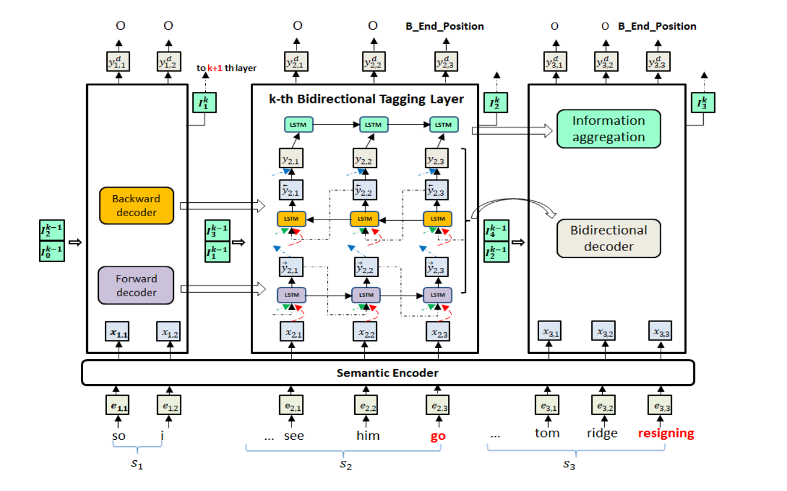

### MLBiNet: A Cross-Sentence Collective Event Detection Network

[zjunlp/DocED: Source code for the ACL 2021 paper "MLBiNet: A Cross-Sentence Collective Event Detection Network ".](https://github.com/zjunlp/DocED)

跨句子问题的解决关键在于：编码语义信息，在文档级去建模事件的相互依赖关系。具体地说，我们首先设计了一个双向解码器，在解码事件标记向量序列时，模拟一个句子内的事件相互依赖关系。其次，利用信息聚合模块对句子级语义信息和事件标签信息进行聚合。最后，我们将多个双向译码器堆叠起来，并提供跨句信息，形成多层双向标签结构，实现信息在句子间的迭代传播。

Seq2Seq 多层双向网络 捕捉多个不同事件

四个部分：语义编码器、双向解码器、信息聚合模块、堆叠式多元双向标记层

用 attention-RNN 作为主要的架构

a) 独立的编码器模块在融合句子级和文档级语义信息方面具有灵活性;

b) RNN解码器模型的上下文向量和当前状态的学习捕捉：可以捕获序列事件标签相关性，将预测的标签向量作为预测 t 符号的输入

**事件抽取和一般 RNN 的区别**

事件抽取中生成序列长度是已知的，与原始序列一致。

ED任务解码器的词汇表不是单词，而是事件类型的集合

#### 语义编码器

利用双向LSTM和自注意机制对每个标记的句子级上下文信息进行编码。

NER类型嵌入 -> $e_t$

LSTM + self-attn  ->$h_t^a$
$$
\mathbf x_t = [\mathbf h_t^a; \mathbf e_t]
$$

#### 双向解码器

事件抽取中生成序列长度是已知的，与原始序列一致。用双向编码器，模拟句子间的关系。

**前向解码**
$$
\begin{gathered}
\overrightarrow{\mathbf{s}}_{t}=f_{\mathrm{fw}}\left(\overrightarrow{\mathbf{y}}_{t-1}, \overrightarrow{\mathbf{s}}_{t-1}, \mathbf{x}_{t}\right) \\
\overrightarrow{\mathbf{y}}_{t}=\tilde{f}\left(W_{y} \overrightarrow{\mathbf{s}}_{t}+b_{y}\right)
\end{gathered}
$$

**后向解码**
$$
\begin{gathered}
\overleftarrow{\mathrm{s}}_{t}=f_{\mathrm{bw}}\left(\overleftarrow{\mathbf{y}}_{t+1}, \overleftarrow{\mathrm{s}}_{t+1}, \mathrm{x}_{t}\right) \\
\overleftarrow{\mathbf{y}}_{t}=\tilde{f}\left(W_{y} \overleftarrow{\mathrm{s}}_{t}+b_{y}\right)
\end{gathered}
$$
**双向解码**

双向解码器通过组合 forward 和 backward 解码器立即模拟事件相互依赖性。垂直标记层利用了两个向前的参数和标签注意机制来捕获双向的事件依赖。

**信息聚合**

对于当前句子，我们关注的信息可以总结为**记录哪些实体和令牌触发哪些事件**。因此，为了总结信息，我们使用事件标签向量 $\mathbf y_t$ 作为输入，设计与事件标签向量 $\mathbf y_t$ 的LSTM层（图1中所示的信息聚合模型）。
$$
\tilde{\mathbf{I}}_{t}=\overrightarrow{\operatorname{LSTM}}\left(\tilde{\mathbf{I}}_{t-1}, \mathbf{y}_{t}\right)
$$
最后的向量 $\tilde{\mathbf I}_{ni}$ 作为总结向量。

句子级的信息聚合模块架起了跨句信息的桥梁，形式化的信息很容易集成到其他句子的解码过程中，增强了事件相关信息。

#### 多层双向网络

在该模块中，我们将多个双向标记层堆叠机制，以在双向解码器中聚集相邻句子的信息，并在句子中传播信息。由双向解码器层和信息聚合模块录制的信息 $(\{\mathbf y_t \}, \mathbf I_i)$ 已捕获句子中的事件相关信息。但是，跨句子信息尚未互动。对于给定的句子，正如我们在表1中所看到的那样，其相关信息主要存储在邻近的句子中，而遥远的句子很少相关。因此，我们建议在相邻句子中传输总结句子信息 $\mathbf I_i$。

由双向解码器层和信息聚合模块录制的信息 $(\{\mathbf y_t \}, \mathbf I_i)$ 捕获句子中的事件相关信息。但是，跨句子信息尚未获取。

可以通过将输入扩展为$\mathbf I_{i-1}$和 $\mathbf I_{i+1}$ 来形成跨句子信息。 k 是层数。

$$
\begin{gathered}
\overrightarrow{\mathbf{s}}_{t}=f_{\mathrm{fw}}\left(\overrightarrow{\mathbf{y}}_{t-1}^{k}, \overrightarrow{\mathbf{s}}_{t-1}, \mathbf{x}_{t}, \mathbf{I}_{i-1}^{k-1}, \mathbf{I}_{i+1}^{k-1}\right) \\
\overleftarrow{\mathbf{s}}_{t}=f_{\mathrm{bw}}\left(\overleftarrow{\mathbf{y}}_{t+1}, \overleftarrow{\mathbf{s}}_{t+1}, \mathbf{x}_{t}, \mathbf{I}_{i-1}^{k-1}, \mathbf{I}_{i+1}^{k-1}\right) \\
\overrightarrow{\mathbf{y}}_{t}^{k}=\tilde{f}\left(W_{y} \overrightarrow{\mathbf{s}}_{t}+b_{y}\right) \\
\overleftarrow{\mathbf{y}}_{t}^{k}=\tilde{f}\left(W_{y} \overleftarrow{\mathbf{s}}_{t}+b_{y}\right) \\
\mathbf{y}_{t}^{k}=\left[\overrightarrow{\mathbf{y}}_{t}^{k} ; \overleftarrow{\mathbf{y}}_{t}^{k}\right]
\end{gathered}
$$

### Entity, Relation, and Event Extraction with Contextualized Span Representations

中文

- NLPCC2016 : A convolution bilstm neural network model for chinese event extraction 中文事件抽取

- ACL2018: **Nugget Proposal Networks for Chinese Event Detection**

- - Author: Lin, Hongyu and Lu, Yaojie and Han, Xianpei and Sun, Le
  - url: [https://www.aclweb.org/anthology/P18-1145.pdf](https://link.zhihu.com/?target=https%3A//www.aclweb.org/anthology/P18-1145.pdf)
  - DataSet: [ACE2005 Chinese Corpus](https://link.zhihu.com/?target=https%3A//catalog.ldc.upenn.edu/LDC2006T06), KBP2017 Corpus
  - Code: [https://github.com/sanmusunrise](https://link.zhihu.com/?target=https%3A//github.com/sanmusunrise/NPNs)

- EMNLP2019: **Event Detection with Trigger-Aware Lattice Neural Network**

	- Author: Ning Ding, Ziran Li, Zhiyuan Liu, Haitao Zheng, Zibo Lin
    - url: [https://www.aclweb.org/anthology/D19-1033/](https://link.zhihu.com/?target=https%3A//www.aclweb.org/anthology/D19-1033/)
    - DataSet: [ACE2005 Chinese Corpus](https://link.zhihu.com/?target=https%3A//catalog.ldc.upenn.edu/LDC2006T06)
    - Code: [https://github.com/thunlp/TLNN](https://link.zhihu.com/?target=https%3A//github.com/thunlp/TLNN)
    - Keywords: Trigger-Aware Lattice

- IJCNLP2019: **A Hybrid Character Representatin for Chinese Event Detection**

- - Author: Xi Xiangyu ; Zhang Tong ; Ye Wei ; Zhang Jinglei ; Xie Rui ; Zhang Shikun
  - url: [https://ieeexplore.ieee.org/document/8851786](https://link.zhihu.com/?target=https%3A//ieeexplore.ieee.org/document/8851786)
  - DataSet: [ACE2005 Chinese Corpus](https://link.zhihu.com/?target=https%3A//catalog.ldc.upenn.edu/LDC2006T06)

非 ace 2005

### MultiIE

在 DuEE 数据集上

sentence-level event extraction f1 = 0.8594
document-level event extraction f1 = 0.7235

### Event Extraction by Answering (Almost) Natural Questions

## Event Detection with Trigger-Aware Lattice Neural Network

### Introduction

事件检测(ED)的目的是在原始文本中定位触发词，然后将它们分类为正确的事件类型。在这一任务中，基于神经网络的模型成为近年来的主流。然而，当涉及到没有自然分隔符的语言时，会出现两个问题，例如中文。首先，基于词的模型存在字触发词不匹配的问题，限制了方法的性能。此外，即使触发词能够被准确定位，触发词多义性的模糊性仍然会影响触发词的分类阶段。为了同时解决这两个问题，我们提出了触发感知格子神经网络（TLNN）。

1. 该框架动态地整合了单词和字符信息，从而避免了触发词不匹配的问题。
2.  此外，对于多义字和多义词，我们借助外部语言知识库对其所有意义进行建模，以缓解歧义触发的问题。

在两个基准数据集上的实验表明，我们的模型能够有效地解决这两个问题，并显著优于现有的方法，给出了最好的结果。本文的源代码可以从https://github.com/thunlp/TLNN获得。

### 结论

我们提出了一种新的事件检测框架TLNN，它可以同时解决触发词不匹配和多触发点的问题。

通过分层表示学习和触发感知特征提取，TLNN能有效地利用多粒度信息，学习深度语义特征。在两个真实数据集上的实验表明，TLNN能够有效地解决这两个问题，并比各种神经网络模型得到更好的经验结果。在未来的工作中，我们将在更多的语言上进行实验

### 问题引入

### 方法

（1）分层表示学习，它以无监督的方式揭示了字符级、词级和语义级的嵌入向量。
（2）触发感知特征抽取器，通过树状结构的LSTM模型自动提取不同层次的语义特征。
（3）序列标记符，用于计算每个字符候选者被触发的概率。

为了缓解触发词的错误匹配问题，创建一个path链接某个词开始和结束位置之间所有词的单元状态（cell state）。
该模型分为三个阶段的处理流程：
1） **预处理模块**：使用Skip-Gram模型将句子序列S={c1,c2,…,cN}转化为字级别和词级别的向量。同时，基于HowNet得到所有的与该句子序列中有关的字和词的注释信息向量（sense-level embedding）。
2） **特征提取模块**
使用触发词感知的网格LSTM（Trigger-aware lattice LSTM）作为特征提取器，它可以同时提取character-level、 word-level、sense-level（使用HowNet对多义词的注释）的信息。
3) **序列标注模块**
采用BIO标注方式，使用CRF预测序列的标注结果，并获得序列标注的loss。

---

其他事件抽取论文整理：

[基于深度学习方法的事件抽取论文整理 - 知乎](https://zhuanlan.zhihu.com/p/136433610)

[ACL Anthology - ACL Anthology](https://aclanthology.org/)
