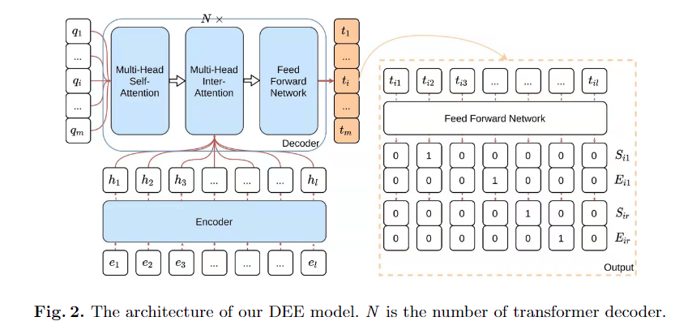

An Effective System for Multi-format Information Extraction

句子级事件抽取算法

我们将每个事件论元视为一个实体，并将该论元对应的**事件类型和角色**连接起来作为**实体类型**。然后SEE任务转换为NER任务。

由于在SEE任务中存在多个标签问题:一个论元可能属于多个事件类型，这里我们使用一个基于指针标记的 NER 方法，为每个候选实体类型标记实体跨度的开始标记和结束标记。

利用BERT 获取上下文表示

分享一个典型的篇章级的事件抽取算法

Encoder， Decoder， Output

编码器

BERT 和 它的一些变体用作编码器来获取文档中每个标记的上下文表示。

- 由于 BERT 需要固定长度，用滑动窗口将文档分成多个段输入，最后合并这些段的结果作为最终输出。

解码器

类似于 Transformer 的解码器。删除 masking 和 positional embedding 的部分。 因为在 DEE 任务中事件的查询嵌入之间没有相关性和位置关系。

触发词抽取——以孪生网络模型为例

转换为视为计算文本对相似度的任务

模型框架

分别提取 trigger 和事件类型的特征和上下文表示 U 和 C：word2vec, bi-LSTM, self-attention

通过U, C, |U-C| 计算相似性：全连接层

循环判断候选的 trigger 是否属于某个事件类型。

(１)将每一个候选触发词作为分类实例，引入了大量反例，造成了正反例严重不均衡，训练语料中每种事件对应的触发词较少，导致召回率较低。

(２)触发词的歧义性.由于词语的多义性，同一个触发词可能对应不同类型的事件.例如，对于“他走了”这句话，很难判断其表示的是他去世了还是离开了.人们在写作时会有意地进行含蓄表达，这进一步增大了触发词识别的难度

1. 在标注训练语料库时，标注者很难从给定的句子中寻找触发词，这使得后续工作难以完成。
2. 与英语中的事件检测不同，汉语中没有自然的词分隔符。因此，模型很难检测到事件触发词，因为分词的结果会导致单词和事件触发词不匹配。具体来说，触发词可以是一个单词的一部分，也可以是多个单词的组合。
3. 中文还有很多一词多义现象。

