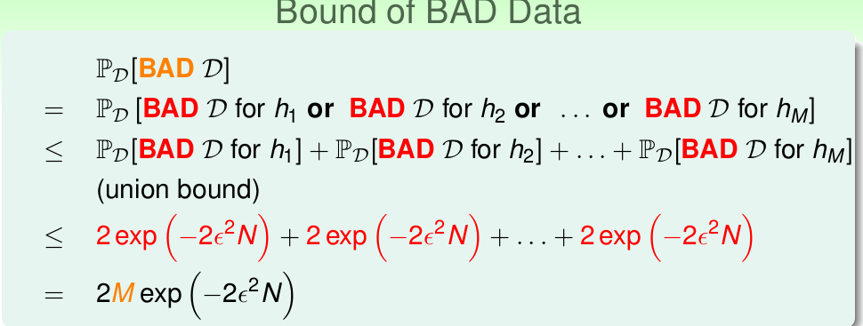
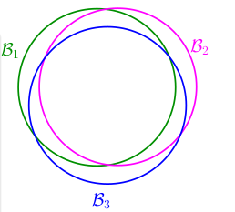
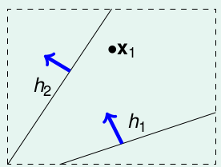
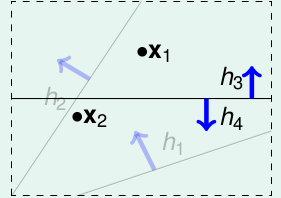
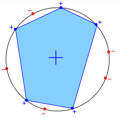
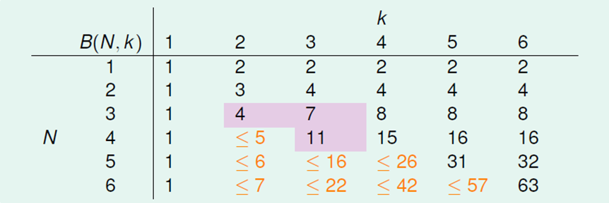
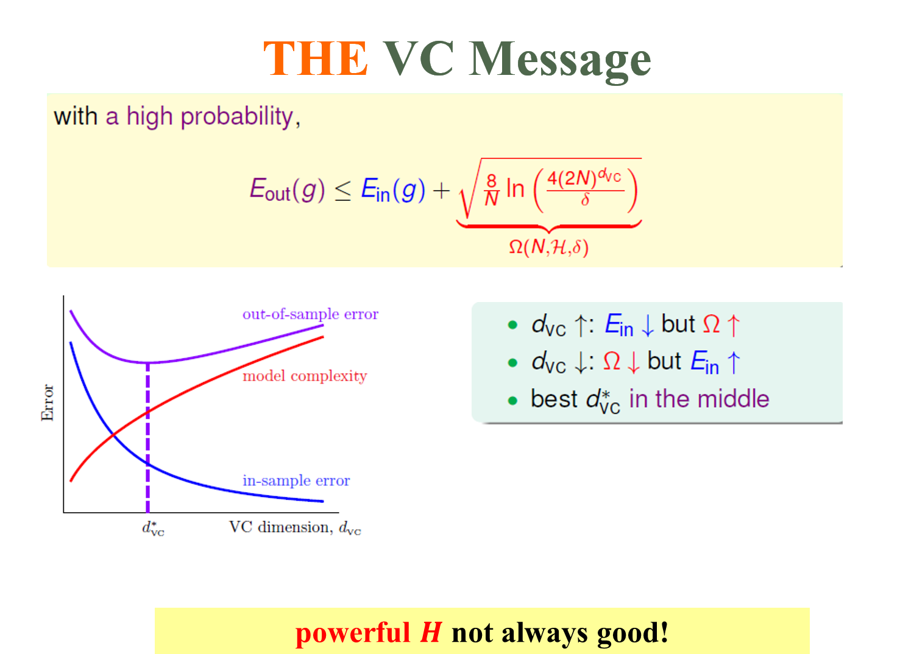

# 机器学习的可学性

## 1. 学习问题

### 1.1 什么是机器学习

什么是“学习”？学习就是人类通过观察、积累经验，掌握某项技能或能力。就好像我们从小学习识别字母、认识汉字，就是学习的过程。而机器学习（Machine Learning），就是让机器（计算机）也能向人类一样，通过观察大量的数据和训练，发现事物规律，获得某种分析问题、解决问题的能力。

下面仔细说明每个符号代表的意义: 当时看的时候，没搞透彻这几个符号，后面就很费劲了。

-  $\mathcal{f}: \chi \to \gamma$ 
   -  $\chi$  表示输入空间，里面包含了很多组输入数据 $x_i$ . 比如拿信用卡审核的例子来说，输入空间 $\chi$ 可以是 (age, gender, annual salary, year in residence, year in job, current debt) 表示的六维的输入空间. (23, male, 10000,1,0.5, 20000)可能就是一组输入的数据。
   -  $\gamma$  则代表的是输出空间。比如前面提到的PLA的输出空间是 $\{+1, -1\}^1$ , 在信用卡例子中，可以用+1表示未来会违约，-1表示未来不会违约。
   -  $f$  是很核心的概念，表示现实中**未知**的某个规律或者某个函数， 我们只能知道的是，把训练数据 $\mathcal{D}$ 中的数据 $x_i$ 作为输入，它会输出  $y_i$ .正因为它的未知，learning要做的事情就是找到一个函数 $\mathcal{g}$ 最接近 $\mathcal{f}$ 。接近是指 $\mathcal{g}$ 对于训练数据 $\mathcal{D}$ 中的运行情况与 $\mathcal{f}$ 的运行情况类似。
-  $\mathcal{D}: {(x_1, y_1), (x_2, y_2),..., (x_N, y_N)}$ ： 表示由输入空间 $\chi$ 中的 $x$ 以及输出空间 $\gamma$ 中的 $y$ 组成的N条数据的训练数据集。
-  $\mathcal{H}$ : 表示**假设空间**，也就是一堆函数的集合: $\{ h_1, h_2, ...\}$ ，我们要找的 $\mathcal{g}$ 就在这里面寻找。在李航老师的《统计学习方法》(第 1 版第 5 页，第 2 版第 7 页) 里面，清楚地说明了假设空间的概念，即“由输入空间到输出空间的映射的集合”。也就是由输入空间 X 到输出空间 Y 的映射 $f :\chi \rightarrow \gamma$ 所构成的集合，该空间是一个函数空间，即由函数所构成的集合。(注：此处我们仅讨论非概率模型。) [周志华老师《机器学习》假设空间和版本空间概念辨析 - 知乎 (zhihu.com)](https://zhuanlan.zhihu.com/p/63186122)
-  $\mathcal{A}$ ：学习算法，通过 $\mathcal{A}$ ，我们才可以在 $\mathcal{H}$ 中找到最接近 $f$ 的那个 $h$ . 因为 $\mathcal{H}$ 的数量是未知的，因此我们必须把学习算法设计的合适，才可以高效的找到那个 $h$ 。
-  $\mathcal{g}$ ：这个就是我们最后找到的 hypothsis,就是通过学习算法 $\mathcal{A}$ 找到的那个最接近f的函数。

有几个注意的点:

-  $\mathcal{D}$ 是一个训练数据集，后面会区分多个训练数据集。
-  $f$  一定是未知。learning的过程就是在 $\mathcal{H}$ 里面找到在训练数据集 $\mathcal{D}$ 表现接近 f 的那个hypothesis (g).

### 1.2 什么时候会使用机器学习

- 事物本身存在某种潜在规律 
- 某些问题难以使用普通编程解决 
- 有大量的数据样本可供使用

## 2. 学习的可行性

### 2.1 没有免费的午餐

NFL ，一句话解释没有免费的午餐定理，我们想要在训练集D之外取得更好的效果是不可能的，只能在D上有很好的效果。

NFL定理表明没有一个学习算法可以在任何领域总是产生最准确的学习器。NFL 说明了无法保证一个机器学习算法在 D 以外的数据集上一定能分类或预测正确，除非加上一些假设条件。

### 2.2 Hoeffding 不等式

[霍夫丁不等式（Hoeffding’s inequality）的若干问题 - 知乎 (zhihu.com)](https://zhuanlan.zhihu.com/p/248624832)

[机器学习推导合集01-霍夫丁不等式的推导 Hoeffding Inequality_liubai01的博客-CSDN博客_霍夫丁不等式推导](https://blog.csdn.net/liubai01/article/details/79947975)

罐子里有很多球，包括橙色球和绿色球，统计学上的做法是，从罐子中随机取出N个球，作为样本，计算这 N 个球中橙色球的比例v，那么就估计出罐子中橙色球的比例约为 v 。

这样做之所以可以成功是因为：
$$
P[|\nu-\mu|>\epsilon] \leq 2 e^{-2 \epsilon^{2} N}
$$

Hoeffding 不等式（适用于有界的随机变量）说明当 $N$ 很大的时候，$v$ 与 $u$ 相差不会很大，它们之间的差值被限定在 $\epsilon$ 之内。我们把结论 $v=u$ 称为 probably approximately correct(PAC)，即抽样样本内某事件发生的比例 v （训练集）和样本空间的某事件发生的比例 u （测试集）很大概率相差很小。

将这个概念拓展到机器学习上来说：

我们将罐子的内容对应到机器学习的概念上来。机器学习中 hypothesis 与目标函数相等的可能性，类比于罐子中橙色球的概率问题；罐子里的一颗颗弹珠类比于机器学习样本空间的 x ；橙色的弹珠类比于h(x) 与 f 不相等；绿色的弹珠类比于 h(x) 与 f 相 等；从罐子中抽取的N个球类比于机器学习的训练样本D，且这两种抽样的样本与总体样本之间都是独立同分布的。

所以呢，如果样本N够大，且是独立同分布的，那么， 从样本中的 $h(x) \neq f(x)$ 概率就能推导在抽样样本外的所有样本中 $h(x) \neq f(x)$ 概率是多少。也就是
$$
P\left[\left|E_{\text {in }}(g)-E_{\text {out }}(g)\right|>\epsilon\right] \leq 2 \cdot M \cdot \exp \left(-2 \epsilon^{2} N\right)
$$

- $E_{\text{in}}(h)$ 表示在**抽样样本**中，$h(x)$ 不与 $f(x)$ 不相等的概率。即模型假设对样本（已知）的错误率。
- $E_{\text {out }}(h)$ 表示**实际所有样本**中，$h(x)$ 与 $f(x)$ 不相等的概率。即模型假设对真实情况（未知）的错误率。
- $E_{\text{in}}(h)= E_{\text {out }}(h)$ 也是 $PAC$ 的。

一般地，$h$ 如果是固定的，$N$ **很大的时候**，$E_{\text{in}}(h)$ 约等于 $E_{\text {out}}(h)$，但并不意味着 $h$ 约等于 $f$ 。因为 h 是固定的，不能保证 $E_{\text{in}}(h)$ 足够小，即使 $E_{\text{in}}(h) \approx E_{\text {out}}(h)$，也可能使 $E_{\text {out}}(h)$ 偏大。

> $\text{Hoeffding's inequality}$ 刻画的是某个事件的真实概率与 m 各不同的 Bernoulli 试验中观察到的频率之间的差异。由上述可知，对我们是不可能得到真实的 $E_{\text {out}}(h)$ ，但我们可以通过让假设h在有限的训练集D上的错误率 $E_{\text{in}}(h)$ 代表 $E_{\text {out}}(h)$ 。什么意思呢？$\text{Hoeffding's inequality}$ 告诉我们：较好拟合训练数据的假设与该假设针对整个数据集的预测，这两者的误差率相差很大的情况发生的概率其实是很小的。

### 2.3 坏数据

假设现在有很多罐子M个（即有M个hypothesis），如果其中某个罐子抽样的球全是绿色，那是不是应该选择这个罐子呢？我们先来看这样一个例子：150个人抛硬币，那 么其中至少有一个人连续5次硬币都是正面朝上的概率是
$$
1 - (\frac{31}{32})^{150} > 99\%
$$
可见这个概率是很大的，但是能否说明5次正面朝上的这个硬币具有代表性呢？答案是 否定的！并不能说明该硬币单次正面朝上的概率很大，其实都是 0.5。一样的道理，抽到全是绿色球的时候也不能一定说明那个罐子就全是绿色球。当罐子数目很多或者抛硬币的人数很多的时候，可能引发Bad Sample，Bad Sample 就是 $E_{\text{in}}(h)$ 和 $E_{\text {out}}(h)$ 差别很大，即选择过多带来的负面影响，选择过多会恶化不好的情形。

根据许多次抽样的到的不同的数据集 $D$ ，$\text{Hoeffding's inequality}$ 保证了大多数的 $D$ 都是比较好的情形，但是对于某个 $h$ 也有可能出现 Bad Data 即 $E_{\text{in}}(h)$ 和 $E_{\text {out }}(h)$ 差很大的 $D$ ，但这是小概率事件。

> 也就是说，抽样存在很多情况，难免出现 Bad sample（ Ein 和 Eout 相差很大的 sample）。霍夫丁不等式说明针对一个 h 出现 bad sample 的几率很小。但是当有很多个 h 时，bad data 就很可能出现（如课件中抛硬币的例子），当bad sample的Ein又很小时，我们作出选择时就会 worse 情况。Bad sample 也就是 Bad Data。

也就是说，不同的数据集 ，对于不同的 hypothesis，有可能成为Bad Data。只要在某个 hypothesis 上是 Bad Data，那么就是Bad Data。只有当在所有的 hypothesis 上都是好的数据，才说明不是Bad Data，可以自由选择演算法 A 进行建模。那么，根据 Hoeffding's inequality，Bad Data的上界可以表示为连级（union bound）的形式：

---

## 3. 训练 vs 测试

### 3.1 回顾

之前引入了统计学知识，如果样本数据足够大，且 hypothesis个 数有限，那么机器学习一般就是可行的。本节课将讨论机器学习的核心问题，严格证明为什么机器可以学习。从上节课最后的问题出发，即当 hypothesis 的个数是无限多的时候，机器学习的可行性是否仍然成立？

由霍夫丁不等式：
$$
P\left[\left|E_{\text {in }}(g)-E_{\text {out }}(g)\right|>\epsilon\right] \leq 2 \cdot M \cdot \exp \left(-2 \epsilon^{2} N\right)
$$
机器学习的定义：目标是找出最好的 $g$ ，使得 $g \approx f $ 且 $E_{\text {out }}(g)$

机器学习的主要目标分成两个核心的问题：

- $E_{in}(g) \approx E_{\text {out }}(g)$
- $E_{in}(g)$ 足够小

分析：

- M 很小时，算法 A 可以选择的 hypothesis 有限，不一定找到 $E_{in}(g)$ 足够小的 hypothesis。

- M 很大时，$E_{in}(g) $ 与 $ E_{\text {out }}(g)$ 差距可能很大。

### 3.2 线的有效数量

> [机器学习基石笔记(2) | 天空的城 (shomy.top)](https://shomy.top/2016/10/09/feasibility-of-learning-2/)

现在，我们考虑一下， BAD DATA的推导公式:  
$$
P[ BAD | \mathcal{H}] \leq_{union bound} P(BAD | h_1) + P(BAD | h_2) + ... + P(BAD | h_M)
$$
这里面有个问题，在计算右边时，直接对每一个 $h$ 求和，这个是上界，也就是当每一项都独立时，该等号才成立，但是实际情况下，并非这样，比如 $h_1, h_2$ 两个很相似的 $hypothsis$ , 也就是说，满足如下两个要求: -  $E_{out}(h_1) \thickapprox E_{out}(h_2)$  -  $E_{in}(h_1) \thickapprox E_{in}(h_2)$ 

也就是说，对于大部分的 $\mathcal{D}$ 来说， $h_1$ 和 $h_2$ 的输出是很类似的，或者说，可以把它们两个当作一类。也就是说， 当 $h_1$ 遇到 BAD DATA时， $h_2$ 会遇到。这样 $(BAD|h_1)$  与 $(BAD|h_2)$ 并不是独立事件，而是很多 $\mathcal{D}$ 造成重复。如下: 我们记  $h_i$ 遇到 BAD DATA为事件 $\mathcal{B}_i$ , 这样实际情况就会如下:

也就是说我们上面的 union-bound 是 over-estimating 的，过大估计了。这样好像就看到了曙光，即使 $M$ 无穷大，但是实际上很多的重复部分，因此我们只需要知道类别的数目是不是就可以代替无穷大的 $M$ 了，先看几个简单的例子.

在 PLA 中， $\mathcal{H} = \{ all \ lines \ in \ \mathcal{R}^2 \}$ , 首先有无穷多条直线，但是看看对不同的输入,看看有几类呢？

当输入只有一个点的时候，我们可以发现，只有两类点:

-  $h_1\text{-}like(x_1) = o$  与  $h_1$ 类似，将 $x_1$ 归为 o
-  $h_2\text{-}like(x_2) = x$  与  $h_1$ 类似，将 $x_1$ 归为 x

再看看输入有两个点的情况：

我们发现有如下四类直线: 得到如下的结果:

输入有三个的时候，画画可以最多有8种:(当三个输入点在一条直线上，只有6种）

输入有4个点的时候，不一样了，不是 $2^4$ 种了，而是只有14种,下面的两种无法用二维直线得到:

以及其对称图形 那么问题来了，对于 N 个输入的 input，到底有多少类直线呢，首先肯定不会超过 $2^N$，因为每个点要么被分到O，要么被分到X。综合上面说的，我们把M可以替换为实际有的类别数目，这样我们的之前的公式就可以改写为：  
$$
 P[ | E_{in} - E_{out} | > \epsilon ] \leq 2 \cdot effective(N) \cdot exp \lgroup -2 \epsilon^2N\rgroup 
$$
问题就是如何求这个 $effective(N)$ 了。

### 3.3 假设的有效数量：对分

接下来先介绍一个新名词：**对分**（dichotomy）。dichotomy 就是将空间中的点（例如二维平面）用一条直线分成正类（蓝色o）和负类（红色x）。令 H 是将平面上的点 用直线分开的所有 hypothesis H 的集合，dichotomy H 与 hypotheses H 的关系是： hypotheses H是平面上所有直线的集合，个数可能是无限个，而 dichotomy H 是平面上能将点完全用直线分开的直线种类，它的上界是 $2^N$ 。接下来，我们要做的就是尝试用 dichotomy 代替 M 。

（忽略上面三点共线的影响，就是忽略 x 的位置对 H 的影响）

我们想要的是 $\mathcal{H}$ 里面的所有的 $h$ 可以在 $\mathcal{D}$ 上产生多少种结果，也就是上面的  $effective N$ 。每一种结果我们称为一个**dichotomies** ,比如上述 $\{ ooxx\}$  就是一个 dichotomies ,很明显，对于输入 $(x_1, x_2...x_N)$ , 最多有 $2^N$ 个 dichotomies。每一个 dichotomies 都是一类 $h$ 产生的。称 $\mathcal{H}(x_1, x_2,..,x_N) = \{ dichotomies\}$ 。 比如上面举的例子中，三个输入情况下:  $\mathcal{H}(x_1, x_2, x_3) = \{ ooo, oox, oxo, oxx, xxx, xxo, xox, xoo\}$  。

我们发现 $\mathcal{H}(x_1, x_2,..,x_N)$ 是跟 $x_1, x_2, ..x_N$ 相关的，因此为了去掉这一个影响因素，基于dichotomies, 我们定义成长函数: 
$$
m_{\mathcal{H}} = max(| \mathcal{H}(x_1, x_2, ..., )|), x_1, x_2...x_N \in \chi
$$
很明显，它是关于 $N, \mathcal{H}$ 的函数，我们计算下在上述的例子中的成长函数的值：

| N    |  $m_{\mathcal{H}}(N)$  |
| :--- | :--------------------- |
| 1    | 2                      |
| 2    | 4                      |
| 3    | max(6,8) = 8           |
| 4    | 14 <  $2^4$            |

下面举几个不同的 $\mathcal{H}$ 的成长函数。

1. **Positive Rays**:  $h(x) = sign(x-a)$ , 输入空间为一维向量， 当 $x_i \geq a$ , 输出 +1, 当 $x_i < a$  时， 输出 -1。如下：

   

   若有N个点，则整个区域可分为N+1段，很容易得到其成长函数 $m_{\mathcal{H}} (N)  =N + 1$，$N$ 很大时，$(N+1) \ll 2^N$

2. **Positive Intervals** 其实就是上一个的双向版， 输入空间仍为一维向量，当  $x_i \in [l ,r] , y_i = 1; x_i \in [l, r], y_i = -1$ , 如下：

   

   根据1，可以很容易发现，这个的实质就是在N+1个位置，找两个位置，作为左右边界。所以 
   $$
   m_{\mathcal{H}} (N) = \lgroup \begin{matrix} N+1 \\ 2 \end{matrix} \rgroup+ 1 = \frac{1}{2}N_2 + \frac{1}{2}N+1 \ll 2^N
   $$
   最后仍然会多一个 dichotomies, 就是 l, r 重合。

3. **Convex Sets** 凸集合，如下图，其中 $R^2 $, 当  $x_i$ 在凸形内， $h(x_i) = +1$ , 反之则 $h(x_i) = -1$ , 如下

   

这个 $\mathcal{H}$ 的成长函数，也就是说最多有多少个 dichotomies，下面可以这样构造一 $\mathcal{D}$ , 可以使得 $m_{\mathcal{H}}(N) = 2^N$ ,将所有的输入点在一个圆上，如下所示：

这样我们可以随机选择 k 个点，然后这 k 个点组成的图形一定是凸的，在里面的点标为 +1, 外面的标为 -1。这样对于 $N$ 个输入来说，任何一个组合都会是一个 dichotomies，所以:  $m_{\mathcal{H}} = 2^N$ .

### 3.4 Break point & Shatter 断点与对分

前面说了几个常见的成长函数:

-  $m_{\mathcal{H}}(N) = N+1$ , Positive Rays
-  $m_{\mathcal{H}}(N) = \frac{1}{2}N_2 + \frac{1}{2}N+1$ , Positive Intervals
-  $m_{\mathcal{H}}(N) = 2^N$ , convex sets
-  $m_{\mathcal{H}}(N) = \text{未知},\ 2D\ perceptron.\ m_{\mathcal{H}}(4) = 14 < 2^4$ 

我们发现，除了 convex sets，其余的成长函数随着N的增大，都会小于 $2^N$ ，于是我们会猜想是不是会是多项式级别的呢？如果这样的话，用这个多项式替代最开始的M, 那么整个 learning 就解决了。

下面我们开始探讨成长函数的增长速度。随着N的增大，成长函数的值 $m_{\mathcal{H}}(N)$ 第一次小于 $2^N$ 的N的取值，我们称为 **break point**。

对于2D perceptron，我们之前分析了 3 个点，可以做出8种所有的dichotomy，而 4 个点，就无法做出所有16个点的dichotomy了。所以，我们就把 4 称为2D perceptron 的 break point（5、6、7等都是break point）。令有 k 个点，如果k大于等于break point 时，它的成长函数一定小于2的 k 次方。
$$
\begin{aligned} 
m_{\mathcal{H}}(K-1) & = 2^N \\ m_{\mathcal{H}}(K) & < 2^K
\end{aligned}
$$
我们称K为 $\mathcal{H}$ 的 **break point** 。为什么要找K呢，因为我们想证明成长函数服从一个多项式的增长，而不是 $2^N$ , 而第一个开始小于 $2^N$ 的那个N，肯定需要着重考察。比如上面的几个例子里面:

- positive rays
  - $m_{}(N) = N + 1 = O(N)$ 
  - break-point = 2
- positive intervals
  - $m_{\mathcal{H}}(N) = \frac{1}{2}N_2 + \frac{1}{2}N+1=O(N^2)$ 
  - break-point = 3 
- convex sets
  - $m_{}(N) = 2^N $
  - no break-point
- 2D perceptron
  - break-point = 4 

如果 $m_{\mathcal{H}}(N) = 2^N$ ，即当 $N < K$ （K为断点） 时，我们称， $\mathcal{H}$ 把 $\mathcal{D}_N$ 这 N 个 input，shatter 了。或者说，这N个输入被 $\mathcal{H}$  shatter 了。若 $N > K$，那无论如何都不会 shatter 。通俗一点就是说，我们的 $\mathcal{H}$ 可以产生所有可能的输出。这几个概念在后续会一直用到。

### 总结

> 成长函数，表示假设空间 H 对 N 个示例所能赋予标记的最大可能结果数。
>
> 对于二分类问题来说，H 中的假设对 D 中 N 个示例赋予标记的每种可能结果称为对 D 的一种**对分（dichotomy）**。
>
> 对分也是增长函数的一种上限。
>
> 打散指的是假设空间H能实现数据集D上全部示例的对分，即增长函数是 $2^N$
>
> [如何通俗地理解机器学习中的 VC 维、shatter 和 break point？ - 知乎 (zhihu.com)](https://www.zhihu.com/question/38607822/answer/149407083)
## 4. 泛化理论 Theory of Generalization

### 4.1 断点的限制 Restriction of Break Point

上一节，我们把 leaning问题归结到了我们提到需要证明 dichotomies 是多项式的，这样就可以保证在N比较大的时候，BAD DATA出现的概率是很小的，这样就说明我们的 learning学到了东西，可以用来预测。

我们发现当 N > k 时，break point限制了增长函数 $m_{\mathcal{H}} $ 的大小。影响因素主要有两个：

- 抽样数据集 N
- break point K（这个变量确定了假设的类型）

下面求证  $m_{\mathcal{H}}$  是多项式大小。

### 4.2 界限函数 Bounding Function

Bound Function 指的是，当break point为k的时候，成长函数 $m_{\mathcal{H}} $ 的最大值，也就是说 $B(N, k)$ 就是 $m_{\mathcal{H}}$ 的上界。我们的目标就是证明：
$$
B(N, k) \leq ploy(N)
$$
引入界限函数是为了简化问题，我们可以不去关心具体分类算法是一维感知机还是二维的，只关心界限函数的大小。

根据经验：

 求解 $B(N, k)$ 的过程十分巧妙：

- 当$k=1$时，$B(N,1)$ 恒为1。 
- 当 $N < k$ 时，根据 break point的定义，很容易得到 $B(N,1) = 2^N$。
- 当 $N = k$时，此时 $N$ 是第一次出现不能被 shatter 的值，所以最多只能有 $2^(N-1)$ 个 dichotomies，则 $B(N,k) = 2^N - 1$ 

（利用数学归纳法和递推关系证明）当 N=1 或者 K=1 时，显然成立。假设当 $N=N_0$ 时，  $B(N_0,K) \leq \sum\limits_{i=0}^{K-1} \left( \begin{array}{c}N_0 \\ i \end{array}\right)$ ，则当 $N=N_0 + 1$ 时:  
$$
\begin{aligned} B(N_0 +1, K) & \leq B(N_0, K) + B(N_0, K-1) \\ & \leq \sum\limits_{i=0}^{K-1} \left( \begin{array}{c}N_0 \\ i \end{array}\right) + \sum\limits_{i=0}^{K-2} \left( \begin{array}{c}N_0 \\ i \end{array}\right) \\ & \leq 1 + \sum\limits_{i=1}^{K-1} 

\left( \left( \begin{array}{c}N_0\ \\ i \end{array} \right) + \left(\begin{array}{c}N_0\\i-1 \end{array}\right) \right) \\ & \leq 1 + \sum\limits_{i=1}^{K-1} \left( \begin{array}{c}N_0+1 \\ i \end{array} \right) \\ & \leq \sum\limits_{i=0}^{K-1}\left( \begin{array}{c}N_0+1 \\ i \end{array} \right) \end{aligned}
$$
得证:  
$$
B(N_0,K) \leq \sum\limits_{i=0}^{K-1} \left( \begin{array}{c}N_0 \\ i \end{array}\right)
$$
很明显, 
$$
B(N_0,K) \leq \sum\limits_{i=0}^{K-1} \left( \begin{array}{c}N_0 \\ i \end{array}\right) = O(N^{K-1})
$$
多项式复杂度，曙光出现。到这里，我们需要需要理一下思路了。  
$$
P\left[ | E_{in}(h) - E_{out}(h)| > \epsilon \right] \leq 2 m_{\mathcal{H}}(N) exp(-2\epsilon^2N)
$$
我们知道当出现 BAD DATA 时候， 会导致 $E_{in}$ 与 $E_{out}$ 变大，此时 learning 并不可行，因此我们开始计算BAD DATA出现的概率，它与 $\mathcal{H}$ 的数目有关系，而很多情况，h都是无限的，于是我们转为求h中的类别数目，我们定义了 $dichotomies$  以及 $m_{\mathcal{H}}(N)$ , 也就是上述的不等式，在一些简单的情况下， $m_{\mathcal{H}}(N)$ 是很容易求的，比如 positive rays 里面,  $m_{\mathcal{H}} = N+1$  等，但是很多我们并不能求出来，比如 2D perceptron,(PLA), 这个时候，我们定义 break point 转而去求 $m_{\mathcal{H}}$ 的上界 $B(N,K)$ ，最终我们证明了 $B(N,K) = O(N^{K-1})$ 。到这里我们基本证明以 perceptron 为例，说明了为什么机器可以学习，为什么训练数据集越大，测试效果越好。 不过还有点小问题，在下面说明。

### 4.3 VC Dimension

我们前面基本都在围绕这训练数据也就是 $\mathcal{D}$ 或者 $E_{in}$ 讨论，把 $\mathcal{H}$ 根据在 $\mathcal{D}$ 上的表现分门别类，这样 $E_{in}$ 就会是有限个，但是却忽略了每一个 $h$ 的 $E_{out}$  是不一样的，也就是说 $E_{out}(h)$ 是无穷多个的，所以说上述的不等式是不太严谨的，实际上的不等式是下面的

$$
 \begin{aligned} \mathbb{P}[BAD] &= \mathbb{P}[\exists h \in \mathcal{H}\text{ s.t. } |E_{in}(h)-E_{out}(h)|\gt \epsilon] \\\ &\leq 4m_{\mathcal{H}}(2N)exp(-\frac{1}{8}\epsilon^2N) \end{aligned} 
$$

证明的主要原则是，如果某个 $E_{in}$ 与 $E_{out}$ 的差别很大时，那么我们重新找一份数据集 $D^{'}$ , 那么 $E_{in}^{'}$ 也会有很大的几率与 $E_{in}$ 差别很大。 具体证明还没搞太明白，先记下了。另外，上面的不等式就是 VC-bound。

下面我们基于break point 给出 VC Dimension(VC 维)的定义:
$$
d_{VC}(\mathcal{H})= \mathop{\arg\max}\limits_{N}( m_{\mathcal{H}} (N)) |_{m_{\mathcal{H}} (N) = 2^N}
$$
也就是 break point K 的前一个:  $d_{VC} = K - 1$ (break point存在的前提下)。我们可以看看上述的4种 $\mathcal{H}$ 的 VC Dimension：

下面我们看看VC维可以给我们带来什么信息。已知成长函数 $m_{\mathcal{H}} \leq N^{k-1}=N^{d_{vc}}$ ，然后代入上述的VC Bound:

$$
\begin{aligned} \mathbb{P}[BAD] &= \mathbb{P}[\exists h \in \mathcal{H}\text{ s.t. } |E_{in}(h)-E_{out}(h)|\gt \epsilon] \\ &\leq 4m_{\mathcal{H}}(2N)exp(-\frac{1}{8}\epsilon^2N) \\ &= 4(2N)^{d_{vc}} exp(-\frac{1}{8}\epsilon^2N)\end{aligned}
$$
那么怎么样才可以说明机器学到了东西呢？有以下三点:

- 存在 break point 即  $d_{vc}(\mathcal{H})$ 是有限的，这样的 $\mathcal{H}$ 才好。

- 训练数据足够多: N 够大，这样 VC bound 可以约束 $E_{in} = E_{out}$ 

- 算法 $\mathcal{}A$  可以找到一个 $E_{in}$ 最小的 H

这样我们就可以说 learned something。以2D Perceptron 为例如下：

当然实际中， $E_{in}$ 很难为0。那我们可以怎么去理解这个VC 维度呢？ 由定义可以知道，VC 维与学习算法 $\mathcal{H}$ ，输入数据 $\mathcal{D}$ ，以及目标的理想函数 $f$ 都是无关的， 它是假设空间 $\mathcal{H}$ 的一个描述，刻画出了 $\mathcal{H}$ 的powerfulness，因为 $d_{vc}$ 越大，可以shatter的点就越多，能力就越强，也就是说我们的 $d_{vc}(\mathcal{H})$ 越大，那么就越可以保证存在一个 h,使得 $E_{in}(h)$ 越小。

那我们应该如何去求解VC 维呢？ 总不能一个一个试，看看能不能被shatter掉。这时候就引入了模型自由度的概念。我们定义模型当中可以自由变动的参数的个数，也就是需要求的参数的个数作为模型自由度，比如在 PLA中，参数为 $w_0,w_1...w_d$  一共有 $d+1$ 个，那么模型的自由度就是 $d+1$ ，同时我们也知道假设空间 $\mathcal{H}$ 的VC 维是  $d+1$ 。这不是巧合，有个经验规律：VC维**约等于**模型的自由度，即参数的个数。以后我们就可以用模型自由度近似代替 $d_{vc}$ 的数值了。

再次回到 VC Bound
$$
\mathbb{P}[\exists h \in \mathcal{H}\text{ s.t. } |E_{in}(h)-E_{out}(h)|\gt \epsilon] = 4(2N)^{d_{vc}} exp(-\frac{1}{8}\epsilon^2N)
$$
其中等式右边为坏数据发生的概率，我们设为 $\delta$ ,那么好数据的概率就是 $1-\delta$ ，在统计学中，这个 $1-\delta$ 又叫做置信度。有了 $\delta$ ，我们可以反解出误差率(也叫泛化误差) $\epsilon$ :
$$
 \epsilon= \sqrt{\frac{8}{N}ln(\frac{4(2N)^{d_{vc}}}{\delta})} 
$$
它就是 $E_{in}$ 和 $E_{out}$ 的差距，对于好数据来说，有很大的几率： $\| E_{in} - E_{out} \| < \epsilon$ ，代入  $\epsilon$ 即:
$$
E_{in}(g)-\sqrt{\frac{8}{N}ln(\frac{4(2N)^{d_{vc}}}{\delta})} \leq E_{out}(g) \leq E_{in}(g)+\sqrt{\frac{8}{N}ln(\frac{4(2N)^{d_{vc}}}{\delta})} 
$$
其中根号里面的式子 $\Omega (N,\mathcal{H},\delta)=\sqrt{...}$  称为model complexity(模型复杂度)。自始至终我们最关心的肯定是 $E_{out}$ ，我们的目标就是让它越小越好，这样才可以在未知数据中表现的好，从不等式中，我们可以看出 $E_{out}$ 的上限会被模型复杂度影响。根据上述的不等式，有了下述的一个关系图:

这个图很重要，也很常用，随着 $d_{vc}$ 的上升， $E_{in}$ 越来越低，但是 model complexity 会一直变大，这样就会导致 $E_{out}$ 也会慢慢变大！这并不是我们想要的结果。也就是说并不是你的 $\mathcal{H}$ 越强大越好其实这个就对应后面讲的过拟合的问题，因此我们需要的是图中的 $d_{vc}^{*}$ 的位置的模型，一个折中的选择，这个也可以对应奥卡姆剃刀理论，简单至上。

最后再说明下样本复杂度的影响，以一个例子做说明，如下：

就是对于 2D perceptron，给定了误差率 $\epsilon$ ，置信度 $1-\delta=0.9$ 。让求需要多少数据量才可以满足条件。很简单直接代入公式就好了，我们可以看出，大概需要3w左右也就是10000倍的 $d_{vc}$ 的训练数据量才可以达到90%的置信度，这可能有点难以接受。幸亏这只是上界，在实际经验中，仅仅需要 10 倍的 $d_{vc}$ 就可以达到要求。我们发现，VC Bound 的 lossness是十分松弛的，这正是因为我们一直都是再取上界的上界，都是在进行放缩操作，比如 $m_{\mathcal{H}}(N) \leq N^(k-1)$ 。再加上VC Bound的通用性，与数据的分布什么的都没关系。

总结一下的话， 其实就是介绍了VC维的定义，以及我们可以用模型自由度来近似代替VC维的大小，最后介绍了VC维以及VC bound 带给我们什么信息，它与训练误差，测试误差之间的联系等。VC 维是个很重要的概念，是机器学习可以学习的理论基础，我们有了合适的 $d_{vc}$ ，有足够的训练数据量，有一个好的算法可以找到一个 $E_{in}$ 最小的h，就说明我们的机器学到东西了。总算总结完了，VC-Dimension 这个坑到今天总算填上了。

> 根据前面的推导，我们知道VC维的大小：
>
> - 与学习算法A无关，
>
> - 与输入变量X的分布也无关，
>
> - 与我们求解的目标函数f 无关。
>
> 它只与**模型**和**假设空间**有关。
>
> [通俗易懂，什么是VC维 | Tsukiyo (xhxt2008.live)](https://xhxt2008.live/2018/05/11/VC-dimension/)

---

1. What statement below shows that $d_{vc} \ge  d+1$?

   A. There are some $d+1$ inputs we can shatter.

   B. We can shatter any set of $d+1$ inputs.

   C. There are some $d+2$ inputs we cannot shatter.

   D. We cannot shatter any set of $d+2$ inputs.
   
2. What statement below shows that $d_{vc} \le  d+1$?

   A. There are some $d+1$ inputs we can shatter.

   B. We can shatter any set of $d+1$ inputs.

   C. There are some $d+2$ inputs we cannot shatter.

   D. We cannot shatter any set of $d+2$ inputs.

3. A, D 因为成长函数是所有可能性的最大值。所以 d-PLA 的 $d_{vc} =  d+1$

---

内容来源于林轩田《机器学习》