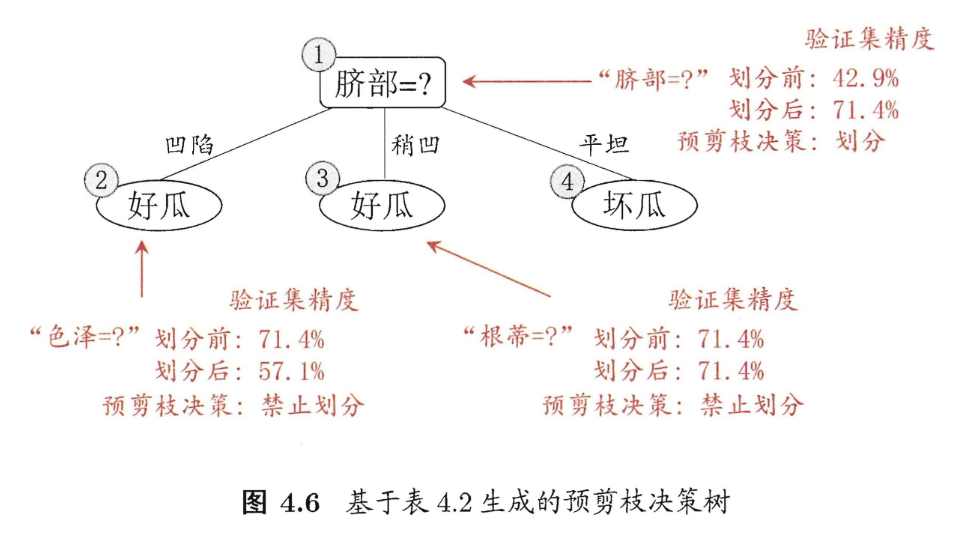
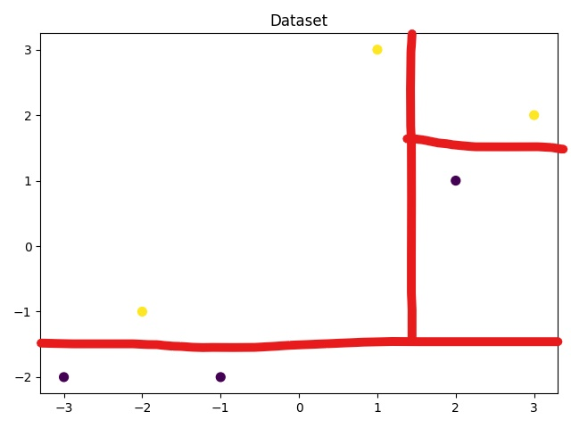
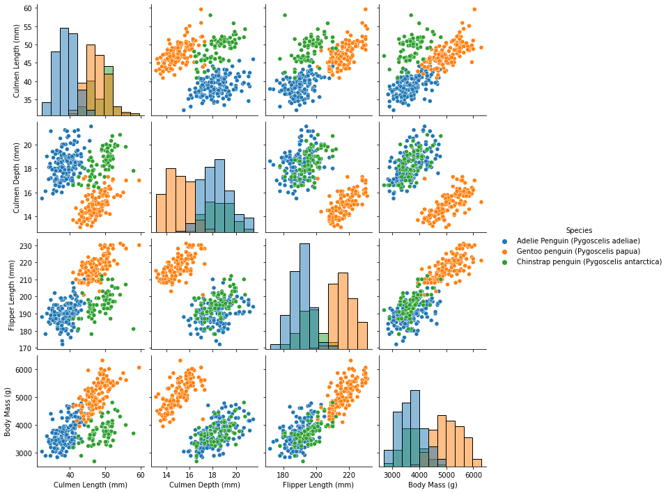
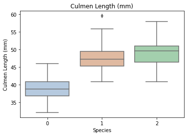
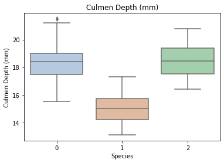
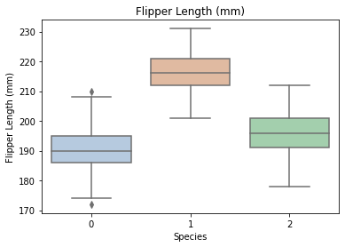
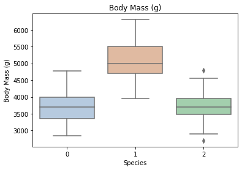
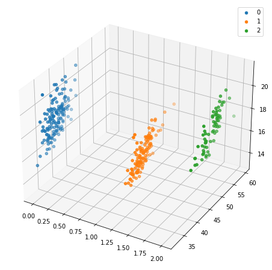
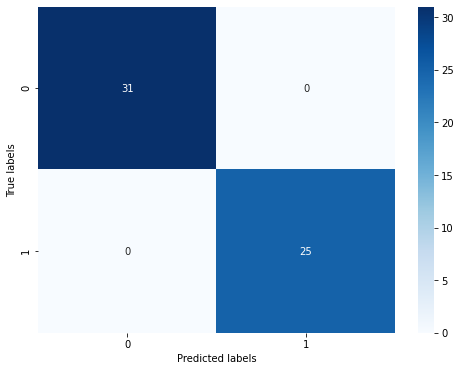

# ID3, C4.5 和 CART 算法


## ID3 算法

信息熵
$$
\mathrm{H}(X) = \sum_i^np_ilog_2(1/p_i) = -\sum_i^np_ilog_2(p_i)
$$
条件熵
$$
\begin{aligned}

H(Y \mid X) 
&=\sum_{i=1}^{n} p\left(x_{i}\right) H\left(Y \mid X=x_{i}\right) \\
&=-\sum_{i=1}^{n} p\left(x_{i}\right) \sum_{j=1}^{m} p\left(y_{j} \mid x_{i}\right) \log _{2} p\left(y_{j} \mid x_{i}\right) \\
&=-\sum_{i=1}^{n} \sum_{j=1}^{m} p\left(x_{i}, y_{j}\right) \log _{2} p\left(y_{j} \mid x_{i}\right)

\end{aligned}
$$
信息增益
$$
G(X) = H(Y) - H(Y|X)
$$


$Y = 1$ 表示买了。$Y = 0$ 表示没买。

$X = 1$ 表示附近学校好。$X = 0$ 表示附近学校不好。

觉得附近学校好，其中买的人有 5 个，不买的个数为 6 个；

觉得附近学校不好的，其中买的人有 1 个，不买的个数为 8 个；

可以得到概率：
$$
P(Y = 1|X = 1) = \frac{5}{11}\\
P(Y = 0|X = 1) = \frac{6}{11} \\
P(Y = 0 | X = 0) = \frac{8}{9} \\
P(Y = 1 | X = 1) = \frac{1}{9} \\
$$

各个条件熵：
$$
\begin{aligned}
H(Y=1|X = 1)  &= -\frac{5}{11}log_2(\frac{5}{11}) -\frac{6}{11}log_2(\frac{6}{11}) = 0.99 
\\
H(Y=1|X=0) &=  -\frac{1}{9}log_2(\frac{1}{9}) -\frac{8}{9}log_2(\frac{8}{9}) = 0.5\\
\end{aligned}
$$
按期望平均得到条件熵，算出 Y = 1 的信息熵：
$$
\begin{aligned}

&P(X = 1) =   \frac{11}{20}\\
&P(X =0) = \frac{9}{20}
\\ \\
&H(Y=1|X) =   \frac{11}{20} \times  0.99  +  \frac{9}{20} \times 0.5 = 0.77
\end{aligned}
$$

算出 Y = 1 的信息熵
$$
H(Y = 1) = -\frac{6}{20}log_2(\frac{6}{20}) -\frac{14}{20}log_2(\frac{14}{20}) = 0.88
$$
然后得出 X 事件的信息增益：
$$
G(X) = H(Y = 1) - H(Y = 1|X) = 0.88-0.77 = 0.11
$$

### 利用信息增益构建决策树

(案例出自西瓜书)

拿西瓜来说，他的样本属性可能是 $[色泽，瓜蒂，敲声，纹理,\dots]$，例如西瓜样本 


我们算出来所有属性的信息增益，D 是样本集合（如上图）：
$$
G(D，瓜蒂) = 0.143 \\
G(D，纹理) = 0.381 \\
G(D，脐部) = 0.289 \\
G(D，触感) = 0.006 \\
G(D，敲声) = 0.141
$$
此时，触感的信息增益最大，我们按照触感划分样本集合，得 D1, D2,  D3


$$
G(D_1 ， 色泽) = 0.043\\ G(D_1 ，根蒂) = 0.458 \\ G(D_1 ，敲声) = 0.331 \\ G(D_1 ，脐部) = 0.458\\ G(D_1 ，触感) = 0.458
$$
……按照这种划分，我们就建立起了一棵决策树：


ID3 算法缺点：

1. 连续特征无法在ID3运用。
2. ID3 采用信息增益大的特征优先建立决策树的节点，在相同条件下，取值比较多的特征比取值少的特征信息增益大，这对预测性能影响很大。
3. ID3算法对于缺失值的情况没有做考虑。
4. 没有考虑过拟合的问题。

后面我们根据这三个问题逐一解决。

## C4.5 算法

### 信息增益比

信息增益准则对取值数目较多的属性有所偏好，ID3 算法的作者 Quinlan 基于上述不足，对ID3算法做了改进，不直接使用信息增益，而使用信息增益比：
$$
R_G(D, A) = \frac{G(D, A)}{IV_A(D)}
$$
D 是样本集合，A 是样本的某个属性，分母是样本 D 关于的属性 A 的固有值 (Intrinsic Value)：
$$
IV_D(A) = -\sum^n_i \frac{|D_i|}{|D|} log_2\frac{|D_i|}{|D|}
$$
属性 A 的某个取值越多，IV 的值就越大：
$$
IV_D(触感) = 0.874 (V = 2) \\ IV_D(色泽) = 1.580 (V = 3) \\ IV_D(编号) = 4.088 (V = 17)
$$
### 连续特征离散化

假设属性 A 的所有取值有 m 个，从小到大排列为 $a_1,a_2,...,a_m$ ，则 C4.5 取相邻两样本值的平均数，一共取得 $m-1$ 个划分点。对于这 $m−1$ 个点，分别计算以该点作为二元分类点时的信息增益。选择信息增益最大的点作为该连续特征的二元离散分类点。

比如取到的增益最大的点为 $a_t$ ,则小于 $a_t$ 的值为 $T_0$ 类别，大于 $a_t$ 的值为 $T_1$ 类别，这样我们就做到了连续特征的离散化。要注意的是，与离散属性不同的是，如果当前节点为连续属性，则该属性后面还可以参与子节点的产生选择过程。

具体来说，假设西瓜数据集有一个颜色深度属性，是被放缩到 [0, 1] 之间的连续值。

| 坏瓜 | 坏瓜 | 好瓜 | 好瓜 | 好瓜 | 坏瓜 | 好瓜 |
| ---- | ---- | ---- | :--- | ---- | ---- | ---- |
| 0.56 | 0.59 | 0.66 | 0.68 | 0.71 | 0.81 | 0.9  |

现在有 7 个数据。先计算相邻两样本值的平均数：

| at1   | at2   | at3  | at4   | at5  | at6   |
| ----- | ----- | ---- | ----- | ---- | ----- |
| 0.575 | 0.625 | 0.67 | 0.695 | 0.72 | 0.855 |

要在这些二元离散分类点找到增益最大的。为啥这里不需要信息增益比？因为所有二元分类点的属性都只有 $T_0$ 和 $T_1$ 。以 $a_{t3}$ 为例子，大于它的值好瓜有 3 个，坏瓜 1 个，小于它的值好瓜有 1 个，坏瓜有 2 个。下式假设 Y 事件为好瓜，$a_{t3}$ 事件为该点为分类点。
$$
\begin{aligned}
H(Y) &= -\frac{4}{7}log_2(\frac{4}{7})-\frac{3}{7}log_2(\frac{3}{7}) = 0.98\\
H(Y | T_1) &= -\frac{1}{4}log_2(\frac{1}{4})-\frac{3}{4}log_2(\frac{3}{4}) = 0.81 \\
H(Y | T_0) &= -\frac{1}{3}log_2(\frac{1}{3})-\frac{2}{3}log_2(\frac{2}{3}) =  0.91 \\
\\
G(a_{t3}) &= H(Y)  - [\frac{4}{7} H(Y | T_0) + \frac{3}{7} H(Y | T_1)] \\
&= 0.98 - [\frac{4}{7} H(Y | T_0) + \frac{3}{7} H(Y | T_1)]  \\
&= 0.12 \\
\end{aligned}
$$
找到最大增益值就可以确定分类点 $a_t$，根据它确定分支节点。

## CART 与基尼系数 

CART 决策树 [Breiman et al., 1984] 使用"基尼指数" (Gini index)来选 择划分属性，假定当前样本集合 D 中第 k 类样本所占的比例为 $P_k (k = 1, 2,. . . , |Y|)$ ，数据集 D 的纯度可用基尼值来度量：
$$
\begin{aligned}
{G}(D) &=\sum_{k=1}^{|\mathcal{Y}|} \sum_{k^{\prime} \neq k} p_{k} p_{k^{\prime}} \\
&=1-\sum_{k=1}^{|\mathcal{Y}|} p_{k}^{2}
\end{aligned}
$$
其反映从数据集 D 中**随机抽取两个样本，其类别标记不一致的概率**。因此，G(D) 越小，则数据集 D 的纯度越高。

于是，我们在候选属性集合 A 中，选择那个使得划分后基尼指数最小的属性作为最优划分属性：
$$
a^* = {\mathop{\arg\min}\limits_{a \in A}} G(D, a)
$$

1. cart 永远是二叉树，二叉树的分支效率要高于ID3和C4.5这样的多叉树；
2. cart 可以处理任何类型的数据，连续和离散；
3. 可以处理分类与回归问题；
4. 使用 gini 指数作为新的衡量方式，gini的计算公式很简单，比信息增益和信息增益率复杂的计算相比简单多了；

## 缺失值处理

现实任务中常会遇到不完整样本，即样本的某些属性值缺失。

有时若简单采取剔除，则会造成大量的信息浪费，因此在属性值缺失的情况下需要解决两个问题：

1. 如何选择划分属性？
2. 给定划分属性，若某样本在该属性上缺失值，如何划分到具体的分支上？

解决方案：

1. 忽略这些缺失的样本。 
2. 填充缺失值，例如给属性A填充一个均值或者用其他方法将缺失值补全。 
3. 如下：

假设训练集 $D$ 和属性 $a$ ，令 $\tilde{D}$ 表示 $D$ 中在属性 $a$ 上没有缺失值的样本子集，$\tilde D^v$ 表示 $D$ 中在属性 $a$ 上取值为$a^v$的样本子集，$D_k$ 表示 $D$ 中属于第 k 类 $(k = 1, 2, .. . , |y|)$的样本子集，$w_x$ 为每个样本的权重，我们可以计算出：

无缺失值样本子集在总样本的比例：
$$
\rho =\frac{\sum_{\boldsymbol{x} \in \tilde{D}} w_{\boldsymbol{x}}}{\sum_{\boldsymbol{x} \in D} w_{\boldsymbol{x}}}
$$
第 k 类在无缺失值样本的比例：
$$
\tilde{p}_{k} =\frac{\sum_{\boldsymbol{x} \in \tilde{D}_{k}} w_{\boldsymbol{x}}}{\sum_{\boldsymbol{x} \in \tilde{D}} w_{\boldsymbol{x}}} \quad(1 \leqslant k \leqslant|\mathcal{Y}|)
$$
无缺失值样本中，属性值 $a^v$ 在属性 $a$ 上的样本比例：
$$
\tilde{r}_{v} =
\frac{ \sum_{\boldsymbol{x} \in \tilde{D}^v}   w_{\boldsymbol{x}} }{\sum_{\boldsymbol{x} \in \tilde{D}} w_{\boldsymbol{x}}}  \quad(1 \leqslant v \leqslant V)
$$
且 $\sum_{k=1}^{|\mathcal{Y}|} \tilde{p}_{k}=1, \sum_{v=1}^{V} \tilde{r}_{v}=1$ 。

对于第一个问题：计算信息增益率时，我们可以根据无缺失样本的比例大小对信息增益率进行打折。即：
$$
\begin{aligned}
{G}(D, a) &=\rho \times {G}(\tilde{D}, a) \\
&=\rho \times\left({H}(\tilde{D})-\sum_{v=1}^{V} \tilde{r}_{v} {H}\left(\tilde{D}^{v}\right)\right)
\end{aligned}
$$
且有：
$$
{H}(\tilde{D})=-\sum_{k=1}^{|\mathcal{Y}|} \tilde{p}_{k} \log _{2} \tilde{p}_{k}
$$
对于第二个问题：若样本 $x$ 在划分属性 $a$ 上的取值未知，则将 $x$ 同时划入所有子结点，样本权值在与属性值 $a^v$ 对应的子结点中调整为 $\tilde{r}^vw_x$，直观地看，这就是让同一个样本以不同的概率划入到不同的子结点中去。

## 剪枝增强泛化

决策树和很多算法一样也会出现过拟合现象。我们可以通过剪枝来增强泛化能力。

- 预剪枝（prepruning）：在构造的过程中先评估，再考虑是否分支。

- 后剪枝（post-pruning）：在构造好一颗完整的决策树后，自底向上，评估分支的必要性。

评估指的是性能度量，即决策树的泛化性能。

### 预剪枝

之前我们就讨论过，将原本的训练集划进一步划分成训练集和验证集。

预剪枝意味着，构造树分支之前，利用验证集，计算决策树不分支时在测试集上的性能，以及分支时的性能。若分支后性能没提升，则选择不分支（即剪枝）。


基于上面的训练集(双线上部)与验证集(双线下部)，来试着剪枝：

在划分前，我们取得不考虑这个属性（脐部），视为叶节点（分类结果）为好瓜，则划分精准度为 $\frac{3}{7}=42.9\% $ 。

当我们按照算法算出来信息增益比，根据脐部将训练集按属性分为 3 种取值（凹陷、稍微凹陷、平坦），形成单节点树。对于每个取值，若好瓜比例大，就确定是分类结果（叶节点）是好瓜，反之即坏瓜。再按照这样的分支来测试性能，验证集经过划分后 ，分别分入凹陷、稍微凹陷、平坦三个分支，计算其精度为 $71.4\%$ 。

显然，分支后精度更高，保留此分支，接着利用训练集训练。



预剪枝降低了计算时间，减少了过拟合风险。

但预剪枝基于"贪心"本质禁止这些分支展开给预剪枝决策树带来了欠拟含的风险。

### 后剪枝

后剪枝则表示在构造好一颗完整的决策树后，从最下面的节点开始，考虑该节点分支对模型的性能是否有提升，若无则剪枝，即将该节点标记为叶子节点，类别标记为其包含样本最多的类别。


对于已经生成的决策树（如上图），用验证集计算可计算出精度是 42.9% 。

若将最底层分支（纹理）删除替换为叶节点，替换后的叶节点包含编号为 {7, 15} 的**训练样本**，于是该叶节点的类别标记为"好瓜"。决策树在修改后在**验证集**的精度变成了 57.1% ，决定剪枝。

以此类推，若精度提高则剪枝，若相等则随意，若降低则不剪枝。

```python
from sklearn.datasets import load_iris
from sklearn.tree import DecisionTreeClassifier


def main():
    iris = load_iris()
    print(iris["feature_names"])

    X = iris.data[:, 2:]  # petal length and width
    y = iris.target

    tree_clf = DecisionTreeClassifier()
    tree_clf.fit(X, y)


if __name__ == '__main__':
    main()
```

## 结论

1. 无论是ID3, C4.5还是CART,在做特征选择的时候都是选择最优的一个特征来做分类决策，但是大多数，分类决策不应该是由某一个特征决定的，而是应该由一组特征决定的。这样决策得到的决策树更加准确。这个决策树叫做多变量决策树(multi-variate decision tree)。在选择最优特征的时候，多变量决策树不是选择某一个最优特征，而是选择最优的一个特征线性组合来做决策。这个算法的代表是OC1，这里不多介绍。
2. 如果样本发生一点点的改动，就会导致树结构的剧烈改变。这个可以通过集成学习里面的随机森林之类的方法解决。

## 实验 1

```python
from sklearn.tree import DecisionTreeClassifier
from sklearn import tree
# 导入画图库
import matplotlib.pyplot as plt
import seaborn as sns
import numpy as np
import graphviz


def main():
    #   Step1: 构造数据集
    x_feature = np.array([[-1, -2], [-2, -1], [-3, -2], [1, 3], [2, 1], [3, 2]])
    y_label = np.array([0, 1, 0, 1, 0, 1])

    #   Step2: 模型训练
    # 调用决策树回归模型
    tree_clf = DecisionTreeClassifier()
    # 调用决策树模型拟合构造的数据集
    tree_clf = tree_clf.fit(x_feature, y_label)

    #   Step3: 数据和模型可视化
    plt.figure()
    plt.scatter(x_feature[:, 0], x_feature[:, 1], c=y_label, s=50, cmap='viridis')
    plt.title('Dataset')
    plt.show()

    # dot_data = tree.export_graphviz(tree_clf, out_file=None)
    # graph = graphviz.Source(dot_data)
    # graph.render("pengunis")

    x_feature_new1 = np.array([[0, -1]])
    x_feature_new2 = np.array([[2, 1]])

    #   Step4: 模型预测
    # 在训练集和测试集上分布利用训练好的模型进行预测
    y_label_new1_predict = tree_clf.predict(x_feature_new1)
    y_label_new2_predict = tree_clf.predict(x_feature_new2)

    print('The New point 1 predict class:\n', y_label_new1_predict)
    print('The New point 2 predict class:\n', y_label_new2_predict)


if __name__ == '__main__':
    main()
```

决策树本质是划分多个间隔：




## 实验 2

根据企鹅数据判断🐧亚属。我们选择企鹅数据（palmerpenguins）进行方法的尝试训练，该数据集一共包含8个变量，其中7个特征变量，1个目标分类变量。共有150个样本，目标变量为 企鹅的类别 其都属于企鹅类的三个亚属，分别是(Adélie, Chinstrap and Gentoo)。包含的三种种企鹅的七个特征，分别是所在岛屿，嘴巴长度，嘴巴深度，脚蹼长度，身体体积，性别以及年龄。

| 变量              | 描述                                                       |
| ----------------- | ---------------------------------------------------------- |
| species           | a factor denoting penguin species                          |
| island            | a factor denoting island in Palmer Archipelago, Antarctica |
| bill_length_mm    | a number denoting bill length                              |
| bill_depth_mm     | a number denoting bill depth                               |
| flipper_length_mm | an integer denoting flipper length                         |
| body_mass_g       | an integer denoting body mass                              |
| sex               | a factor denoting penguin sex                              |
| year              | an integer denoting the study year                         |

参考 https://tianchi.aliyun.com/course/278/3422

### 初始化

```python
from sklearn.tree import DecisionTreeClassifier
from sklearn import tree
# 导入画图库
import matplotlib.pyplot as plt
import seaborn as sns
import numpy as np
import graphviz
import pandas as pd
```

### Step1：数据读取/载入
我们利用Pandas自带的read_csv函数读取并转化为DataFrame格式


```python
data = pd.read_csv('src/penguins_raw.csv')
data = data[['Species', 'Culmen Length (mm)', 'Culmen Depth (mm)',
             'Flipper Length (mm)', 'Body Mass (g)']]
```

### Step2：查看数据的整体信息


```python
pd.set_option('display.max_columns', 1000)
data.info()
print(data.describe())
```

    <class 'pandas.core.frame.DataFrame'>
    RangeIndex: 344 entries, 0 to 343
    Data columns (total 5 columns):
     #   Column               Non-Null Count  Dtype  
    ---  ------               --------------  -----  
     0   Species              344 non-null    object 
     1   Culmen Length (mm)   342 non-null    float64
     2   Culmen Depth (mm)    342 non-null    float64
     3   Flipper Length (mm)  342 non-null    float64
     4   Body Mass (g)        342 non-null    float64
    dtypes: float64(4), object(1)
    memory usage: 13.6+ KB
           Culmen Length (mm)  Culmen Depth (mm)  Flipper Length (mm)  \
    count          342.000000         342.000000           342.000000   
    mean            43.921930          17.151170           200.915205   
    std              5.459584           1.974793            14.061714   
    min             32.100000          13.100000           172.000000   
    25%             39.225000          15.600000           190.000000   
    50%             44.450000          17.300000           197.000000   
    75%             48.500000          18.700000           213.000000   
    max             59.600000          21.500000           231.000000   
    
           Body Mass (g)  
    count     342.000000  
    mean     4201.754386  
    std       801.954536  
    min      2700.000000  
    25%      3550.000000  
    50%      4050.000000  
    75%      4750.000000  
    max      6300.000000  


```python
print(data.head())
data = data.fillna(data.mean())
#   data.fillna(data.median())
data['Species'].unique()
# 利用value_counts函数查看每个类别数量
pd.Series(data['Species']).value_counts()
```

                                   Species  Culmen Length (mm)  Culmen Depth (mm)  \
    0  Adelie Penguin (Pygoscelis adeliae)                39.1               18.7   
    1  Adelie Penguin (Pygoscelis adeliae)                39.5               17.4   
    2  Adelie Penguin (Pygoscelis adeliae)                40.3               18.0   
    3  Adelie Penguin (Pygoscelis adeliae)                 NaN                NaN   
    4  Adelie Penguin (Pygoscelis adeliae)                36.7               19.3   
    
       Flipper Length (mm)  Body Mass (g)  
    0                181.0         3750.0  
    1                186.0         3800.0  
    2                195.0         3250.0  
    3                  NaN            NaN  
    4                193.0         3450.0  


    Adelie Penguin (Pygoscelis adeliae)          152
    Gentoo penguin (Pygoscelis papua)            124
    Chinstrap penguin (Pygoscelis antarctica)     68
    Name: Species, dtype: int64


Step4:可视化描述


```python
sns.pairplot(data=data, diag_kind='hist', hue='Species')
plt.show()
```





从上图可以发现，在2D情况下不同的特征组合对于不同类别的企鹅的散点分布，以及大概的区分能力。Culmen Lenth与其他特征的组合散点的重合较少，所以对于数据集的划分能力最好。


```python
'''
为了方便我们将标签转化为数字
   'Adelie Penguin (Pygoscelis adeliae)'        ------0
   'Gentoo penguin (Pygoscelis papua)'          ------1
   'Chinstrap penguin (Pygoscelis antarctica)   ------2 
'''
def trans(x):
    if x == data['Species'].unique()[0]:
        return 0
    if x == data['Species'].unique()[1]:
        return 1
    if x == data['Species'].unique()[2]:
        return 2
    
data['Species'] = data['Species'].apply(trans)
```


```python
for col in data.columns:
    if col != 'Species':
        sns.boxplot(x='Species', y=col, saturation=0.5, palette='pastel', data=data)
        plt.title(col)
        plt.show()
```






    



    



    


利用箱型图我们也可以得到不同类别在不同特征上的分布差异情况。


```python
# 选取其前三个特征绘制三维散点图
from mpl_toolkits.mplot3d import Axes3D

fig = plt.figure(figsize=(10,8))
ax = fig.add_subplot(111, projection='3d')

data_class0 = data[data['Species']==0].values
data_class1 = data[data['Species']==1].values
data_class2 = data[data['Species']==2].values
# 'setosa'(0), 'versicolor'(1), 'virginica'(2)
ax.scatter(data_class0[:,0], data_class0[:,1], data_class0[:,2],label=data['Species'].unique()[0])
ax.scatter(data_class1[:,0], data_class1[:,1], data_class1[:,2],label=data['Species'].unique()[1])
ax.scatter(data_class2[:,0], data_class2[:,1], data_class2[:,2],label=data['Species'].unique()[2])
plt.legend()

plt.show()
```





### Step3: 利用决策树模型在二分类上进行训练和预测


```python
# 为了正确评估模型性能，将数据划分为训练集和测试集，并在训练集上训练模型，在测试集上验证模型性能。
from sklearn.model_selection import train_test_split

# 选择其类别为0和1的样本 （不包括类别为2的样本）
data_target_part = data[data['Species'].isin([0,1])][['Species']]
data_features_part = data[data['Species'].isin([0,1])][['Culmen Length (mm)','Culmen Depth (mm)',
            'Flipper Length (mm)','Body Mass (g)']]

# 测试集大小为20%， 80%/20%分
x_train, x_test, y_train, y_test = train_test_split(data_features_part, data_target_part, test_size = 0.2, random_state = 2021)
```


```python
# 从sklearn中导入决策树模型
from sklearn.tree import DecisionTreeClassifier
from sklearn import tree
# 定义 决策树模型 
clf = DecisionTreeClassifier(criterion='entropy')
# 在训练集上训练决策树模型
clf.fit(x_train, y_train)
```


    DecisionTreeClassifier(criterion='entropy')


```python
# 可视化
import graphviz
dot_data = tree.export_graphviz(clf, out_file=None)
graph = graphviz.Source(dot_data)
graph.render("penguins")
```


    'penguins.pdf'


```python
# 在训练集和测试集上分布利用训练好的模型进行预测
train_predict = clf.predict(x_train)
test_predict = clf.predict(x_test)
from sklearn import metrics

# 利用accuracy（准确度）【预测正确的样本数目占总预测样本数目的比例】评估模型效果
print('The accuracy of the Logistic Regression is:',metrics.accuracy_score(y_train,train_predict))
print('The accuracy of the Logistic Regression is:',metrics.accuracy_score(y_test,test_predict))

# 查看混淆矩阵 (预测值和真实值的各类情况统计矩阵)
confusion_matrix_result = metrics.confusion_matrix(test_predict,y_test)
print('The confusion matrix result:\n',confusion_matrix_result)

# 利用热力图对于结果进行可视化
plt.figure(figsize=(8, 6))
sns.heatmap(confusion_matrix_result, annot=True, cmap='Blues')
plt.xlabel('Predicted labels')
plt.ylabel('True labels')
plt.show()
```

    The accuracy of the Logistic Regression is: 0.9954545454545455
    The accuracy of the Logistic Regression is: 1.0
    The confusion matrix result:
     [[31  0]
     [ 0 25]]



    


### Step4:利用 决策树模型 在三分类(多分类)上 进行训练和预测


```python
# 测试集大小为20%， 80%/20%分
x_train, x_test, y_train, y_test = train_test_split(data[['Culmen Length (mm)','Culmen Depth (mm)',
            'Flipper Length (mm)','Body Mass (g)']], data[['Species']], test_size = 0.2, random_state = 2021)
# 定义 决策树模型 
clf = DecisionTreeClassifier()
# 在训练集上训练决策树模型
clf.fit(x_train, y_train)
```


    DecisionTreeClassifier()


```python
# 在训练集和测试集上分布利用训练好的模型进行预测
train_predict = clf.predict(x_train)
test_predict = clf.predict(x_test)

# 由于决策树模型是概率预测模型（前文介绍的 p = p(y=1|x,\theta)）,所有我们可以利用 predict_proba 函数预测其概率
train_predict_proba = clf.predict_proba(x_train)
test_predict_proba = clf.predict_proba(x_test)

print('The test predict Probability of each class:\n',test_predict_proba)
# 其中第一列代表预测为0类的概率，第二列代表预测为1类的概率，第三列代表预测为2类的概率。

# 利用accuracy（准确度）【预测正确的样本数目占总预测样本数目的比例】评估模型效果
print('The accuracy of the Logistic Regression is:',metrics.accuracy_score(y_train,train_predict))
print('The accuracy of the Logistic Regression is:',metrics.accuracy_score(y_test,test_predict))
```

    The test predict Probability of each class:
     [[0.  0.  1. ]
     [1.  0.  0. ]
     [1.  0.  0. ]
     [0.  0.  1. ]
     [0.  1.  0. ]
     [1.  0.  0. ]
     [0.  1.  0. ]
     [0.  1.  0. ]
     [1.  0.  0. ]
     [1.  0.  0. ]
     [1.  0.  0. ]
     [0.  0.  1. ]
     [0.  1.  0. ]
     [1.  0.  0. ]
     [0.  0.  1. ]
     [1.  0.  0. ]
     [0.  0.  1. ]
     [0.  1.  0. ]
     [0.5 0.5 0. ]
     [1.  0.  0. ]
     [0.  1.  0. ]
     [0.  1.  0. ]
     [0.  1.  0. ]
     [1.  0.  0. ]
     [0.  1.  0. ]
     [1.  0.  0. ]
     [1.  0.  0. ]
     [1.  0.  0. ]
     [0.  1.  0. ]
     [0.  1.  0. ]
     [0.  0.  1. ]
     [1.  0.  0. ]
     [1.  0.  0. ]
     [0.  1.  0. ]
     [0.  0.  1. ]
     [1.  0.  0. ]
     [1.  0.  0. ]
     [1.  0.  0. ]
     [0.  0.  1. ]
     [0.  1.  0. ]
     [1.  0.  0. ]
     [1.  0.  0. ]
     [1.  0.  0. ]
     [0.  0.  1. ]
     [1.  0.  0. ]
     [1.  0.  0. ]
     [1.  0.  0. ]
     [1.  0.  0. ]
     [0.  1.  0. ]
     [0.  0.  1. ]
     [1.  0.  0. ]
     [0.  1.  0. ]
     [1.  0.  0. ]
     [0.  0.  1. ]
     [0.  0.  1. ]
     [0.  1.  0. ]
     [0.  1.  0. ]
     [1.  0.  0. ]
     [1.  0.  0. ]
     [0.  1.  0. ]
     [0.  1.  0. ]
     [1.  0.  0. ]
     [0.  1.  0. ]
     [0.  0.  1. ]
     [1.  0.  0. ]
     [1.  0.  0. ]
     [0.  0.  1. ]
     [0.  1.  0. ]
     [1.  0.  0. ]]
    The accuracy of the Logistic Regression is: 0.9963636363636363
    The accuracy of the Logistic Regression is: 0.9710144927536232


    The confusion matrix result:
     [[33  0  1]
     [ 0 21  0]
     [ 1  0 13]]


    

## 实验 3

下载蘑菇数据集，来判断蘑菇是不是有毒吧！

 https://www.kaggle.com/uciml/mushroom-classification

```python
# 举例：绘图案例 an example of matplotlib
%matplotlib inline
import numpy as np
import matplotlib.pyplot as plt
```


```python
import pandas as pd
data = pd.read_csv("mushrooms_new.csv")
data.head()
from sklearn.preprocessing import LabelEncoder
for col in data:
    data[col] = LabelEncoder().fit_transform(data[col])
# data.head()

```


```python
# data.describe()
```


```python
# data.info()
```


```python
x_feature, y = data[data.columns.drop("class")], data["class"]
# x_feature.head()
# y.head()
# y.unique()
# x_feature.unique()


```


```python
from sklearn.tree import DecisionTreeClassifier
from sklearn import tree
clf = DecisionTreeClassifier()
clf.fit(x_feature, y)

```


    DecisionTreeClassifier()


```python
from sklearn import tree
import graphviz
dot_data = tree.export_graphviz(clf, out_file=None)
graph = graphviz.Source(dot_data)
graph.render("mushroom")
```


    'mushroom.pdf'


## 本文资料参考

[决策树（Decision Tree）-ID3、C4.5、CART比较](https://www.cnblogs.com/huangyc/p/9768858.html)

《机器学习》周志华

https://tianchi.aliyun.com/course/278/3422

### 决策树对缺失值是如何处理的?

决策树处理缺失要考虑以下三个问题： 

1、当开始选择哪个属性来划分数据集时，样本在某几个属性上有缺失怎么处理：

（1）忽略这些缺失的样本。 

（2）填充缺失值，例如给属性A填充一个均值或者用其他方法将缺失值补全。 

（3）计算信息增益率时根据缺失率的大小对信息增益率进行打折，例如计算属性A的信息增益率，若属性 A的缺失率为0.9，则将信息增益率乘以0.9作为最终的信息增益率。 

2、一个属性已经被选择，那么在决定分割点时，有些样本在这个属性上有缺失怎么处理？ 

（1）忽略这些缺失的样本。 

（2）填充缺失值，例如填充一个均值或者用其他方法将缺失值补全。 把缺失的样本，按照无缺失的样本被划分的子集样本个数的相对比率，分配到各个子集上去，至于那 些缺失样本分到子集1，哪些样本分配到子集2，这个没有一定准则，可以随机而动。

（3）把缺失的样本分配给所有的子集，也就是每个子集都有缺失的样本。

（4）单独将缺失的样本归为一个分支。 

3、决策树模型构建好后，测试集上的某些属性是缺失的，这些属性该怎么处理？

（1）如果有单独的缺失值分支，依据此分支。 

（2）把待分类的样本的属性A分配一个最常出现的值，然后进行分支预测。 

（3）待分类的样本在到达属性A结点时就终止分类，然后根据此时A结点所覆盖的叶子节点类别状况为其 分配一个发生概率最高的类。