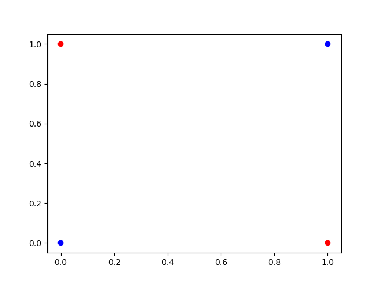
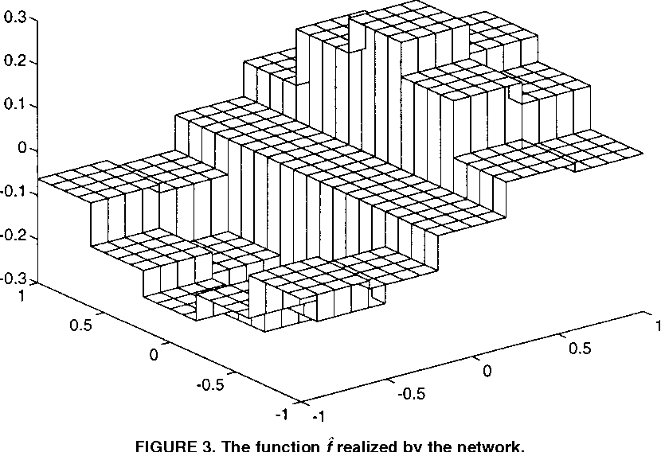
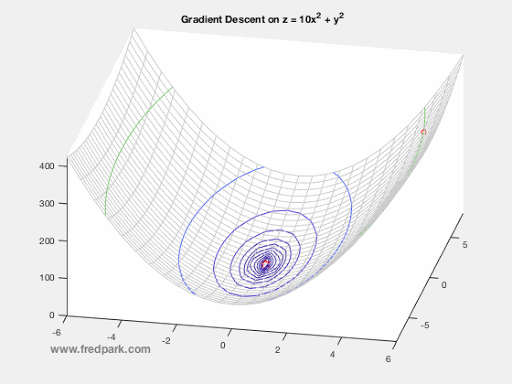
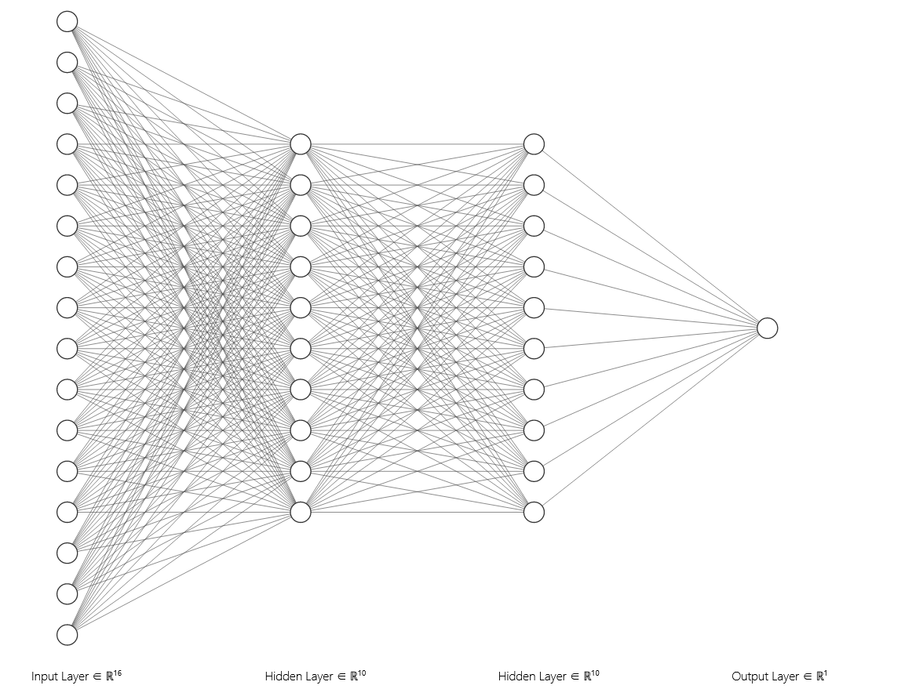

# 神经网络


## 1 直觉理解

### 1.1 感知机的问题

感知机可以学习 AND 函数，也可以学习 OR 函数。

AND 函数（与运算，全真则为真，否则为假）可以表示成数据：
$$
\mathbf{X} = 
\left [
\begin{aligned}
0&&0 \\
0&&1 \\
1&&0 \\
1&&1\\
\end{aligned} 
\right ]
\\
\mathbf y = \left [
\begin{aligned}
-1\\
-1\\
-1\\
1
\end{aligned} 
\right ]
$$


由图知我们可以用一条线把正负类分开。（红色为正类，蓝色为负类，下面相同）

OR 运算（或运算，有真则为真，否则为假）可以表示成数据：
$$
\mathbf{X} = 
\left [
\begin{aligned}
0&&0 \\
0&&1 \\
1&&0 \\
1&&1\\
\end{aligned} 
\right ]
\\
\mathbf y = \left [
\begin{aligned}
-1\\
1\\
1\\
1
\end{aligned} 
\right ]
$$


同样，我们可以用一条线把正负类分开。

**传统感知机只能处理线性可分的数据集。**

当我们遇到想模拟 XOR （异或运算，不同为真，相同为假）数据集时，数据如下
$$
\mathbf{X} = 
\left [
\begin{aligned}
0&&0 \\
0&&1 \\
1&&0 \\
1&&1\\
\end{aligned} 
\right ]
\\
\mathbf y = \left [
\begin{aligned}
-1\\
1\\
1\\
-1
\end{aligned} 
\right ]
$$


由图可知，这个数据集不是线性可分的，因此不是感知机可以处理的。或者说，这是一个非线性的问题，通过线性集成的方法解决不了。

### 1.2 复合函数 -> 万能函数逼近器

如果可以用感知机模拟 OR 和 AND 运算（感知机当然也可以模拟 NOT 运算，遇真变假，遇假变真，相当于感知机在 x 轴上将 0 分为正类，1 分为负类）。那能不能把他们组合起来，就像计算机组成那样，组合成 XOR 运算？——这样的想法是自然的。我们知道
$$
XOR(x_1,x_2) = OR(AND(-x_1, x_2), AND(x_1, -x_2))
$$
或者熟悉的数学形式是：
$$
x_1 \oplus x_2 = (\neg x_1 \land x_2) \lor (x_1 \land \neg x_2)
$$
他的计算图是：


（一般来说，感知机的输出层（最后一层神经元）会有一个激活函数，也许是 Sigmoid 函数）

感知机层数在增加，模型的复杂度也在增加，使最后得到的 Output 能解决一些非线性的复杂问题。这样我们就构造了一个多层的感知机，可以模拟 XOR 运算。我们介绍的这种多层感知机（multi­-layer perceptron）模型其实就是 Neural Network。

准确来说，**多层感知机是神经网络的一个子集。**

对分类问题的拟合：


对回归问题的拟合：




### 1.3 前向传播


这是一个两层神经网络，输入层不算在内。这样的网络可以看作是输入的 $x_0, x_1,x_2$ 经过从左到右的运算：

第 0 层：**输入层**，$a^{[0]} = [x_0,x_1,x_2]^\top$

第 1 层：**隐藏层**，$z^{[1]} = {\bf W}^{[1] \top} a^{[0]}, a^{[1]} = g(z^{[1]})$，先将上层输入线性组合，再通过激活函数得到了这一层。

第 3 层：**输出层**，$z^{[2]} = {\bf W}^{[2] \top} a^{[1]},a^{[2]} = g( z^{[2]}) $，先将上层输入线性组合，再通过激活函数得到了这一层。

实际上，神经网络是一个复杂的复合函数：
$$
\hat{y} = f({\bf x})= g[{\bf W}^{[2] \top} g({\bf W}^{[1] \top} {\bf x})]
$$

### 1.4 激活函数和代价函数

#### 1.4.1 激活函数

如果我们把已知的线性模型 linear regression, logistic regression(LR) **增加嵌套层次**，同样也可以提高泛化能力。前者可以解决回归问题，后者可以解决分类问题。

先选择分类问题来谈论神经网络。

若每个节点的 transformation function 都是线性运算，那么由每个节点的线性模型组合成的神经网络模型也必然是线性的。这跟直接使用一个线性模型在效果上并没有什么差异，模型能力不强，反而花费了更多不必要的力气。所以一般来说，中间节点不会选择线性模型。

**没有激活函数或者只有线性的激活函数的神经网络本质上只是一个线性回归模型。**换句话说，我们需要非线性的激活函数来增加模型的拟合能力，增强非线性拟合的能力。

Sigmoid 函数是应用广泛的非线性激活函数之一，也就是之前的对数几率函数。我们可以用 Sigmoid 函数作为每层的非线性变换。
$$
g(x) = \frac{1}{1+e^{-x}}
$$


利用 Sigmoid 的神经网络就相当于多层 logistic 回归模型的集成嵌套。下一步，我们还需要为神经网络找到合适的代价函数和最小化代价的方法。

#### 1.4.2 代价函数

一个自然的想法是，像 logistic 回归一样利用平方损失函数。遗憾的是，对于二分类问题来说，平方损失函数效果并不好。这里采用交叉熵函数作为损失函数：
$$
L(y, \hat y) = -yln(\hat{y})-(1-y)ln(1-\hat{y})
$$
其中 $y \in\{ 1, 0 \}$ 表示正类或者负类，$\hat y \in \R$ 是我们预测结果为正类的概率。于是：
$$
\hat y =g({\bf W^\top a^{[i]}})
$$
可以发现一个性质：

当 $y = 0$，也就是实际为负类，则 $$ H = -ln(1-\hat y)$$，等价于预测为负类的概率的负对数。

当 $y = 1$，也就是实际为正类，则 $$ H = -ln(\hat y)$$ ，等价于预测为正类的概率的负对数。

使其最小化，可以兼顾正负类，相当于使其预测概率最大化。

### 1.5 反向传播

#### 1.5.1 梯度下降与学习率

寻找最值一个常用的方法就是求导，但在实际应用根本不可能这么理想，一定找得到唯一解。这时候就必须要靠找近似解的方式去逼近极值。

梯度下降法 (gradient descent) 是最优化理论里面的一个一阶找最佳解的一种方法，主要是希望用梯度下降法找到函数(刚刚举例的式子)的局部最小值，因为梯度的方向是走向局部最大的方向，所以在梯度下降法中是往梯度的反方向走。 




梯度下降法并不是下降最快的方向，它只是目标函数在当前的点的切平面（超平面）上下降最快的方向。

#### 1.5.3 反向传播

把误差从后往前传，然后逐个更新每层的参数 W

$$
E_{in}(\hat{\bf y}, {\bf y}) = L(g[{\bf W}^{[2] \top} g({\bf W}^{[1] \top} {\bf X})], {\bf y})
$$

首先，为了了解整个反向传播的过程。假设我们的 W 只有一行一列，也就是每层只有一个神经元，先看单个 w 怎么求然后再推广。

对 w2 的偏导：
$$
\begin{aligned}
\frac{\partial E_{in}}{\partial {w}^{[2]}}  
&= \frac{\partial L}{\partial g} \cdot\frac{\partial g}{\partial {z}^{[2]}} \frac{\partial {z}^{[2]}}{\partial { w}^{[2]}}  \\ \\
&= \frac{\partial L}{\partial z^{[2]}} \cdot   \frac{\partial {z}^{[2]}}{\partial { w}^{[2]}}
\end{aligned}
$$

对 w1 的偏导：

$$
\begin{aligned}
\frac{\partial E_{in}}{\partial { w}^{[1]}} 

&= \frac{\partial L}{\partial g} \cdot \frac{\partial g}{\partial z^{[2]}} \frac{\partial {z}^{[2]}}{\partial { a}^{[1]}} 
\cdot 
\frac{\partial g}{\partial z^{[1]}} \frac{\partial {z}^{[1]}}{\partial{w}^{[1]}}
\\ \\
&=  \frac{\partial L}{\partial z^{[1]}} \cdot   \frac{\partial {z}^{[1]}}{\partial{w}^{[1]}}
\end{aligned}
$$
如果假设 有 n 层神经网络对 $w^{[i]}$ 求偏导，那么肯定是：
$$
\begin{aligned}
\frac{\partial E_{in}}{\partial { w}^{[0]}} 

&= \frac{\partial L}{\partial g} \cdot \frac{\partial g}{\partial z^{[n]}} \frac{\partial {z}^{[n]}}{\partial { a}^{[n - 1]}} 
\cdot 
\frac{\partial g}{\partial z^{[n - 1]}} \frac{\partial {z}^{[n - 1]}}{\partial{a}^{[0]}} 
\cdots
\frac{\partial g}{\partial z^{[i]}} \frac{\partial {z}^{[i]}}{\partial{w}^{[i]}} \\
\\
&= \frac{\partial L}{\partial z^{[i]}}  \cdot   \frac{\partial {z}^{[i]}}{\partial{w}^{[i]}}  \\

\end{aligned}
$$
因为有
$$
\begin{aligned}
z^{[i]} &= w^{[i]}a^{[i - 1]}  \\\\
\Rightarrow \frac{\partial z^{[i]}}{\partial w^{[i]}} &= a^{[i - 1]} 
\end{aligned} 
$$
（结论）也就是说
$$
\begin{aligned}

\frac{\partial E_{in}}{\partial { w}^{[i]}}  
&= \frac{\partial L}{\partial z^{[i]}}  \cdot   \frac{\partial {z}^{[i]}}{\partial{w}^{[i]}} \\\\
&= \frac{\partial L}{\partial z^{[i]}}  \cdot a^{[i -1]} 

\end{aligned}  \tag 1
$$
（结论）我们又知道，L 关于 z 偏导有递推式：
$$
\begin{aligned}

\frac{\partial L}{\partial z^{[i]}} 
&= \frac{\partial L}{\partial a^{[i]}} \frac{\partial g}{\partial z^{[i]}}  
\end{aligned} \tag{2}
$$
（结论）容易知道，L 关于 a 的偏导：
$$
\begin{aligned}

\frac{\partial L}{\partial a^{[i]}} 
&= \frac{\partial L}{\partial z^{[i + 1]}} \frac{\partial  z^{[i + 1]}}{\partial a^{[i]}} \\\\
&= \frac{\partial L}{\partial z^{[i + 1]}} w^{[i + 1]}

\end{aligned} \tag{3}
$$
$\mathrm d Z$ 可以看作 $\frac{\partial L}{\partial z}$ 的矩阵形式，对于**矩阵微积分**而言就有：
$$
\begin{aligned}
\mathrm{d} Z^{[i]} &=  \mathrm{d} A^{[i]} * \mathrm{d} g    \\ \\
\mathrm{d} W^{[i]} &= \frac{1}{m} \mathrm{d} Z^{[i]} \cdot A^{[i]}  \\   \\
\mathrm{d} A^{[i-1]} &=   W^{[i ]} *  \mathrm{d}Z^{[i]}   \\ \\
\end{aligned}
\tag{1, 2, 3}
$$
可参考：

[机器学习中的矩阵向量求导(一) 求导定义与求导布局 - 刘建平Pinard - 博客园](https://www.cnblogs.com/pinard/p/10750718.html)

[机器学习中的矩阵向量求导(五) 矩阵对矩阵的求导 - 刘建平Pinard - 博客园](https://www.cnblogs.com/pinard/p/10930902.html)


### 1.6 常用的激活函数

[Activation Functions — All You Need To Know!](https://medium.com/analytics-vidhya/activation-functions-all-you-need-to-know-355a850d025e)

### 1.6.1 sigmoid

在什么情况下适合使用 Sigmoid激活函数呢？

- Sigmoid 函数的输出范围是 0 到 1。由于输出值限定在 0 到 1，因此它对每个神经元的输出进行了归一化；
- 用于将预测概率作为输出的模型。由于概率的取值范围是 0 到 1，因此 Sigmoid 函数非常合适；
- 梯度平滑，避免「跳跃」的输出值；
- 函数是可微的。这意味着可以找到任意两个点的 sigmoid 曲线的斜率；
- 明确的预测，即非常接近 1 或 0。

Sigmoid激活函数有哪些缺点？

- 倾向于梯度消失；
- 函数输出不是以 0 为中心的，这会降低权重更新的效率；
- Sigmoid 函数执行指数运算，计算机运行得较慢。

### 1.6.2 Tanh / 双曲正切激活函数


tanh 是一个双曲正切函数。tanh 函数和 sigmoid 函数的曲线相对相似。但是它比 sigmoid 函数更有一些优势。

- 首先，当输入较大或较小时，输出几乎是平滑的并且梯度较小，这不利于权重更新。二者的区别在于输出间隔，tanh 的输出间隔为 1，并且整个函数以 0 为中心，比 sigmoid 函数更好；
- 在 tanh 图中，负输入将被强映射为负，而零输入被映射为接近零。

注意：在一般的二元分类问题中，tanh 函数用于隐藏层，而 sigmoid 函数用于输出层，但这并不是固定的，需要根据特定问题进行调整。

### 1.6.3  ReLU激活函数

$$
ReLU({\bf z}) = \max(\mathbf z, 0) 
$$

- 当输入为正时，不存在梯度饱和问题。
- 计算速度快得多。ReLU 函数中只存在线性关系，因此它的计算速度比 sigmoid 和 tanh 更快。

当然，它也有缺点：

1. Dead ReLU 问题。当输入为负时，ReLU 完全失效，在正向传播过程中，这不是问题。有些区域很敏感，有些则不敏感。但是在反向传播过程中，如果输入负数，则梯度将完全为零，sigmoid 函数和 tanh 函数也具有相同的问题；
2. 我们发现 ReLU 函数的输出为 0 或正数，这意味着 ReLU 函数不是以 0 为中心的函数。

leaky ReLU


## 2 算法步骤

输入：

数据集 $D=\{({\bf x_i, y_i})\}^m_{i=1}$，设定初始的层数 $n$，学习率 $\eta$，各层的权值 $W^{[i]}$ ，阈值函数 $g(\cdot)$。

过程：

$\text{for all }({\bf x_i, y_i}) \in D \text{ do}$ 

​	$\text{for i-th layer in all layers do}$

​		计算第 $i$ 层输出 $a^{[i]}$， $a^{[i]} = g(W^{[i]\top} a^{[i - 1]})$

​		计算第 $i$ 层的梯度 $\mathrm{d}W^{[i ]}$

​		更新第 $i$ 层的权值 $W^{[i]} := W^{[i]} - \eta\cdot \mathrm{d}W^{[i ]}  $

$\text{end for}$

$\text{until }$ 达到指定条件


## 3 应用场景

### 3.1 神经网络适用于什么问题？

### 3.2 如何选择激活函数？

[Activation Functions | Fundamentals Of Deep Learning (analyticsvidhya.com)](https://www.analyticsvidhya.com/blog/2020/01/fundamentals-deep-learning-activation-functions-when-to-use-them/)

- Sigmoid 函数以及它们的联合通常在**分类器（二元分类问题）**中有更好的效果；
- 由于梯度爆炸的问题，在某些时候需要避免使用 Sigmoid 和 Tanh 激活函数；
- ReLU 函数是一种常见的激活函数，学习的速度很快，而且和 Leaky ReLU 不容易使得激活函数的导数为 0，在目前使用是最多的；记住，ReLU永远只在隐藏层中使用。根据经验，我们一般可以从 ReLU 激活函数开始，但是如果 ReLU 不能很好的解决问题，再去尝试其他的激活函数。
- 如果遇到了一些死的神经元，我们可以使用 Leaky ReLU 函数；


## 4 用 numpy 实现神经网络

接下来我们利用全连接的神经网络来识别手写数字(MNIST)，只训练一个二元分类器，判断是否是某个数字。

MNIST 数据集每张图片有 784 个像素，用 784\*10, 10\*10, 10\*1 作为网络结构。


$$
\begin{aligned}
\mathrm{d} Z^{[i]} &=  \mathrm{d} A^{[i]} * \mathrm{d} g    \\ \\
\mathrm{d} W^{[i]} &= \frac{1}{m} \mathrm{d} Z^{[i]} \cdot A^{[i]}  \\   \\
\mathrm{d} A^{[i-1]} &=   W^{[i ]} *  \mathrm{d}Z^{[i]}   \\ \\
\end{aligned}
\tag{1, 2, 3}
$$


 ```python
 import joblib
 import numpy as np
 import matplotlib.pyplot as plt
 from sklearn.datasets import fetch_openml
 
 
 def look_data(data, length=5):
     print(data.shape)
     print(data[:length])
 
 
 def load_mnist(target='5'):
     memory = joblib.Memory('../view')
     fetch_openml_cached = memory.cache(fetch_openml)
     mnist_dataset = fetch_openml_cached('mnist_784', as_frame=True)
     X = mnist_dataset['data'].values
     y = np.where(mnist_dataset['target'].values == target, 1, 0).reshape(70000, 1)
     return X, y
 
 
 def norm(data, training_ratio=0.8):
     # 归一化处理
     # maximum, minimum = np.max(training_data, axis=0, keepdims=True), np.min(training_data, axis=0, keepdims=True)
     # average = np.sum(training_data, axis=0, keepdims=True) / training_data.shape[0]
 
     # 利用训练集的最大最小归一化测试集
     # data = (data - minimum) / (maximum - minimum)
     mid = 127.5
     data = (data - mid) / mid
     return data
 
 
 class Network:
 
     def __init__(self, num_of_weights: tuple):
         # np.random.seed(0)
         self.W = np.random.normal(0, 1, num_of_weights)
         self.Z = None
         self.A = None
         self.ac_name = None
         self.dZ = None
         self.dA = None
 
     def save_file(self, file_name):
         joblib.dump(self, file_name)
 
     @staticmethod
     def read_file(file_name):
         return joblib.load(file_name)
 
     def forward(self, A, ac_name='sigmoid'):
         self.Z = np.dot(self.W, A)
         self.ac_name = ac_name
         if ac_name == 'ReLU':
             self.A = Network.ReLU(self.Z)
         elif ac_name[:7] == 'sigmoid':
             self.A = Network.sigmoid(self.Z)
         else:
             print("None of the activation_name.")
 
     def backpropagation(self, input_layer, y, eta=0.001):
         if self.ac_name == "ReLU":
             self.dZ = self.dA * Network.ReLU(self.A)
         elif self.ac_name == 'sigmoid':
             p = Network.sigmoid_derivative(self.A)
             self.dZ = self.dA * p
         elif self.ac_name == 'sigmoid_CE':
             self.dZ = Network.sigmoid_CE_derivative(self.A, y)
         else:
             print("None of the activation_name.")
         dW = np.dot(self.dZ, input_layer.A.T) / y.shape[0]
         input_layer.dA = np.dot(self.W.T, self.dZ)
         self.W -= eta * dW
 
     def get_loss(self, y):
         assert len(self.A) == len(y)
         cross_entropy = Network.cross_entropy(self.A, y)
         return np.sum(cross_entropy, axis=0) / y.shape[0]
 
     @staticmethod
     def cross_entropy(y_hat, y):
         return np.where(y == 1, -np.log(y_hat), -np.log(1 - y_hat))
 
     @staticmethod
     def ReLU(z):
         return np.maximum(z, 0)
 
     @staticmethod
     def ReLU_derivative(z):
         return np.where(z >= 0, 1, 0)
 
     @staticmethod
     def sigmoid(z):
         return 1. / (1. + np.exp(-z))
 
     @staticmethod
     def sigmoid_CE_derivative(a, y):
         return a - y
 
     @staticmethod
     def sigmoid_derivative(a):
         return a * (1 - a)
 
     @staticmethod
     def train(X_train, y_train, training_offset, num_epochs, batch_size, eta):
         hidden_layer1 = Network((10, 784))
         hidden_layer2 = Network((10, 10))
         out_layer = Network((1, 10))
 
         for epoch_id in range(num_epochs):
             X_train, y_train = shuffle_in_unison(X_train, y_train)
             mini_batches = [(k, k + batch_size) for k in range(0, training_offset, batch_size)]
 
             for iter_id, mini_batch in enumerate(mini_batches):
                 start, end = mini_batch
                 X_batch = X_train[start: end, :].T
                 y_batch = np.int32(y_train[start: end, :]).reshape(X_batch.shape[1], 1).T
 
                 hidden_layer1.forward(X_batch, ac_name="sigmoid")
                 hidden_layer2.forward(hidden_layer1.A, ac_name="sigmoid")
                 out_layer.forward(hidden_layer2.A, ac_name="sigmoid_CE")
 
                 print("epoch_id: {0} , iter_id: {1}, {2}".format(
                     epoch_id, iter_id, out_layer.get_loss(y_batch)))
 
                 init_net = Network((1, 1))
                 init_net.A = X_batch
                 out_layer.dA = 1
                 out_layer.backpropagation(input_layer=hidden_layer2,
                                           y=y_batch, eta=eta)
                 hidden_layer2.backpropagation(input_layer=hidden_layer1,
                                               y=y_batch, eta=eta)
                 hidden_layer1.backpropagation(input_layer=init_net,
                                               y=y_batch, eta=eta)
         hidden_layer1.save_file("hidden_layer1")
         hidden_layer2.save_file("hidden_layer2")
         out_layer.save_file("out_layer")
 
         return hidden_layer1, hidden_layer2, out_layer
 
     @staticmethod
     def predict(X_test, y_test, hidden_layer1, hidden_layer2, out_layer):
         X_test = X_test.T
         result = []
         for i in range(X_test.shape[1]):
             x = X_test[:, i].reshape(X_test.shape[0], 1)
             hidden_layer1.forward(x, ac_name="sigmoid")
             hidden_layer2.forward(hidden_layer1.A, ac_name="sigmoid")
             out_layer.forward(hidden_layer2.A, ac_name="sigmoid")
             result.append(int(out_layer.A[0][0] > 0.5))
             # y_test[0, i]
         result = np.array(result).reshape(len(result), 1)
         result = np.where(result == y_test, 1, 0)
         accuracy = np.sum(result) / result.shape[0]
         print("accuracy = {:.2%}".format(accuracy))
 
 
 def draw(row):
     digit = row[1:].reshape(28, 28)
     plt.imshow(digit, cmap="binary")
     plt.show()
 
 
 def shuffle_in_unison(a, b):
     assert len(a) == len(b)
     shuffled_a = np.empty(a.shape, dtype=a.dtype)
     shuffled_b = np.empty(b.shape, dtype=b.dtype)
     permutation = np.random.permutation(len(a))
     for old_index, new_index in enumerate(permutation):
         shuffled_a[new_index] = a[old_index]
         shuffled_b[new_index] = b[old_index]
     return shuffled_a, shuffled_b
 
 
 def main():
     X_src, y_src = load_mnist('4')
 
     # 划分训练集
     training_ratio = 0.8
     training_offset = int(y_src.shape[0] * training_ratio)
     X_src = norm(X_src)
     X_train, X_test = X_src[:training_offset], X_src[training_offset:]
     y_train, y_test = y_src[:training_offset], y_src[training_offset:]
 
     hidden_layer1, hidden_layer2, out_layer = Network.train(
         X_train=X_train, y_train=y_train,
         num_epochs=5, batch_size=200, eta=0.01,
         training_offset=training_offset)
 
     # hidden_layer1 = Network.read_file("hidden_layer1")
     # hidden_layer2 = Network.read_file("hidden_layer2")
     # out_layer = Network.read_file("out_layer")
 
     test_num = -2
     Network.predict(X_test[:test_num], y_test[:test_num], hidden_layer1, hidden_layer2, out_layer)
 
 
 if __name__ == '__main__':
     main()
     #
     # test = np.array([[1, 2, 3]])
     # test1 = np.array([[1], [2], [3]])
     # print(test.dot(test1))
 ```


## 5 推导和证明

### 5.1 交叉熵与似然函数

假设特征 $\bf x_i$ 的每一个分量都满足伯努利分布（二项分布），也就是 ${\bf x}_i^j \sim B$。

对于 $\bf x_i$ 对应事件 ${ y_i} = \{0,1\}$，其 1 发生的概率我们的预测是 $\hat y_i$，以及对立事件 0 发生的概率是 $1 - \hat y$：
$$
P({y_i }  = 1 |{\bf x_i}) = {\hat y_i} \\
P({ y_i }  = 0 |{\bf x_i}) = 1 - { \hat y_i} \\
$$
我们就能统一为：
$$
P(y_i | {\bf x_i}) = \hat y_i ^{y_i} + (1 - \hat y_i)^{1 - y_i}
$$
对数似然函数为：
$$
\begin{aligned}
L &= -\sum_i^m\log P(y_i | {\bf x_i}) \\
 &=  -\sum_i^m[y_i\hat y_i + (1 - y_i)\hat y_i]
\end{aligned}
$$
对数用来降幂，负号可以把求最大变成求最小，最终我们的目标是 ${\arg\min} L$，L 也就是交叉熵损失函数。

---

## 多层神经网络


### 梯度下降法


1. 不可逆函数
2. 


一个标准的机器学习处理流程是

```mermaid
graph LR
	数据获取及分析-->数据预处理-->特征工程-->训练模型选择与调优-->后处理-->模型评估

```


1. 为什么要以平方误差为损失函数？

2. 样本归一化：预测时的样本数据同样也需要归一化，但使用训练样本的均值和极值计算，这是为什么？

3. 当部分参数的梯度计算为0（接近0）时，可能是什么情况？是否意味着完成训练？


答案：

> 1. 平方误差函数有曲度，更容易寻找到
>
> 2. 因为在真实的世界我们是不可能知道要预测的样本的均值和极值的。
>
> 3. 不一定。也可能是因为偏导数为 0