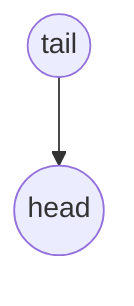
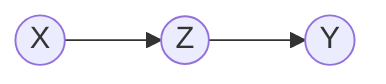
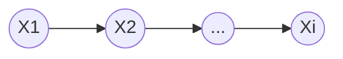
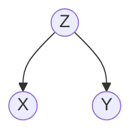
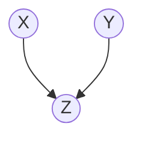
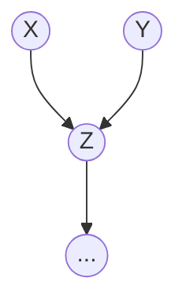

# 贝叶斯学习与概率图模型

[聊一聊机器学习的MLE和MAP：最大似然估计和最大后验估计 - 知乎 (zhihu.com)](https://zhuanlan.zhihu.com/p/32480810)

[贝叶斯学派与频率学派有何不同？ - 知乎 (zhihu.com)](https://www.zhihu.com/question/20587681/answer/1693868621)

[Bayesian Networks - YouTube](https://www.youtube.com/watch?v=TuGDMj43ehw&ab_channel=BertHuang)

[hao/bayesian-network-python.md at master · memect/hao (github.com)](https://github.com/memect/hao/blob/master/awesome/bayesian-network-python.md)

[8机器学习 07贝叶斯网络 - YouTube](https://www.youtube.com/watch?v=EvXKAP5F_-4&ab_channel=砖家王二狗)

[【双语字幕】CMU 10-708《概率图模型》课程(2020) by Eric P. Xing_哔哩哔哩 (゜-゜)つロ 干杯~-bilibili](https://www.bilibili.com/video/BV1tX4y1371G)

## 基础

- 加法法则 
  - $P(X) = \mathop{\sum}\limits_{i = 0}^N P(X, Y_i)P(Y_i)$
  - $P(X_1)=\int P(X_1,X_2)dX_2$ 相当于上面的求和。
  - $f_X(x) = \int ^{+\infty}_{-\infty} f_{X,Y}(x,y) dy$ 
- 乘法法则 
  - $P(AB) = P(A)P(B|A) = P(B)P(A|B)$
  - 如果事件 A 与 B 是两独立事件，则 $P(AB) = P(A)P(B)$
- 链式法则 
  - $P(X_1, X_2, \cdots, X_n) =  \prod\limits_{i=1}^ N P(X_i | X_1, X_2, \cdots, X_{i-1})$
  - 例如：
    - $P(X_1, X_2) = P(X_1 | X_2) \cdot P(X_2)$
    - $P(X_1, X_2, X_3) = P(X_1 | X_2, X_3) \cdot P(X_2, X_3)= P(X_1 | X_2, X_3) \cdot  P(X_2 | X_3) \cdot P(X_3)$

- 贝叶斯法则
  - $P(X_1 | X_2) = \frac{P(X_2| X_1) P(X_1) }{P(X_2)}$
  - 推导：$P(X_1 | X_2) = \frac{P(X_1  ,X_2)}{P(X_2)} = \frac{P(X_2 | X_1) P(X_1)}{P(X_2)}$
  - 或者：$P(X_1 | X_2) =   \frac{P(X_1  ,X_2)}{P(X_2)} =  \frac{P(X_1  ,X_2)}{ \int P(X_1,X_2)dX_1} =  \frac{P(X_2| X_1) P(X_1)}{ \int P(X_2 | X_1) P(X_1) dX_1}$

在链式法则中，如果数据维度特别高，那么的采样和计算非常困难，我们需要在一定程度上作出简化，

- 朴素贝叶斯作出了**条件独立性假设**，即 $P(X_1, X_2, \cdots, X_{i-1},X_{i+1},\cdots, X_n | X_i) = \prod\limits_{1\le i \le N}^{i \neq j} P(X_i|X_j)$ 
- Markov 假设给定数据的维度是以时间顺序出现，给定当前时间的维度，那么下一个维度与之前的维度独立。
- HMM 采用齐次 Markov 假设。
- 在 Markov 假设基础上，加入条件独立性假设，使其一般化，对维度划分集合 $A,B,C$，使得 $X_A\perp X_B|X_C$ (在给定 $X_C$ 的条件下，$X_A$ 独立于 $X_B$)。

## 贝叶斯网络

已知联合分布中，各个随机变量之间的依赖关系，那么可以通过拓扑排序（根据依赖关系）可以获得一个有向图。而如果已知一个图，也可以直接得到联合概率分布的因子分解：
$$
P(X_1,X_2,\cdots,X_p)=\prod\limits_{i=1}^p P(X_i|X_{parent(i)})
$$

定义箭头方向为 head，另一侧为 tail。

网络中有三种典型结构，一般利用因子分解和链式法则证明独立性：

### head-to-tail 型

> 我们想要对接力跑步比赛中一个队伍完成比赛的时间进行建模。假设这个队伍有三名成员：Alice，Bob 和 Carol 。三人**A**lice 的完成时间 t0 影响了 Bob 的完成时间 t1，因为 Bob 只能在 Alice 完成比赛后才开始。类似的，Carol 也只会在 Bob 完成之后才开始，所以 Bob 的完成时间 t1 直接影响了 Carol 的完成时间 t2。——《深度学习》

可以理解为接力赛例子的有向图模型：Z 被观测后，X 到 Y 的路径被阻塞，说明 X 和 Y 条件独立， $Indep(X, Y|Z)$ 。
$$
\begin{aligned}
P(X, Z,Y) &= P(Y | Z) \cdot P(Z | X) \cdot  P(X)\\
P(X, Z,Y) &= P(Y | Z,X) \cdot P(Z | X) \cdot P(X)  \\

&\Rightarrow	P(Y | Z) = P(Y| Z, X) \\
&\Rightarrow	Indep(X, Y|Z)

\end{aligned}
$$

head-to-tail 其实就是一个链式网络——Markov 链：在给定条件下，$X_{i+1}$ 的分布与 $X_{i-1}, \cdots,X_2,X_1$ 条件独立，它只与 $X_i$ 有关，满足
$$
P(X_{i+1} = x | X_{i}, \cdots,X_2,X_1) = P(X_{i+1} = x | X_i)
$$

### tail-to-tail 型

Z 被观测后（给定 Z 后），X 到 Y 路径阻塞 (blocked)，X 和 Y 条件独立 $Indep(X,Y|Z)$。
$$
\begin{aligned}
P(X, Y,Z) &= P(X | Z)\cdot  P(Y | Z) \cdot P(Z) \\
P(X, Y,Z) &= P(X| Y,Z) \cdot P(Y|Z) \cdot P(Z)  \\

&\Rightarrow	P(X | Z) = P(X|Y, Z) \\
&\Rightarrow	Indep(X,Y|Z)
\end{aligned}
$$

### head-to-head 型

若 Z 没被观测到，X 到 Y 阻塞，$Indep(X,Y)$。
$$
\begin{aligned}
P(X, Y, Z) &= P(X) \cdot P(Y) \cdot P(Z |X, Y) \\
P(X, Y, Z) &= P(Z|X,Y) \cdot P(Y | X) \cdot P(X) \\
&\Rightarrow	P(Y) = P(Y|X) \\
&\Rightarrow	Indep(X,Y) \\
\end{aligned}
$$
若 Z 被观测，则路径是通的，X 和 Y 不独立，属于非条件独立 $\neg Indep(X,Y|Z)$。

如下图，若 Z 和它的任意后代 (如 d) 被观测，则 X, Y 阻塞，X, Y 条件相关。

## 关键

假设 X, Y, Z 是三组随机变量，同样可以利用上面的规则。

$Indep(X, Y|Z)$ **等价于** 从 X 到 Y 的每一条路都被 Z 阻塞了。

一条路被 Z 组阻塞 **等价于**：

- 或者该节点在 head-to-tail 型路径中的 Z 组；
- 或者该节点在 tail-to-tail 型路径中的 Z 组；
- 或者该节点为 A 在 head-to-head 型路径中，x 既不在 Z 组也不是 Z 组的任意后代。

